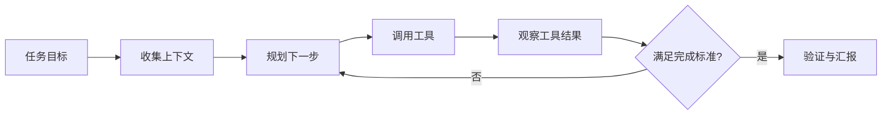
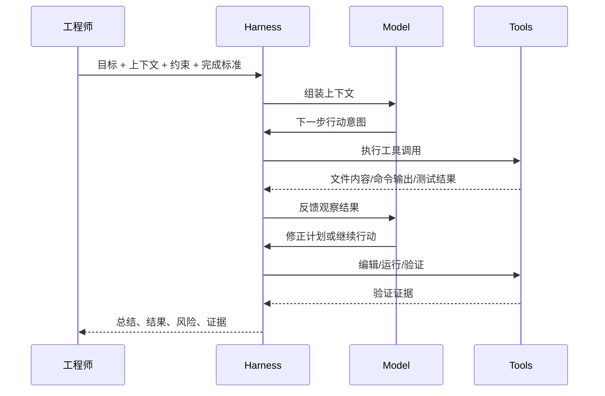
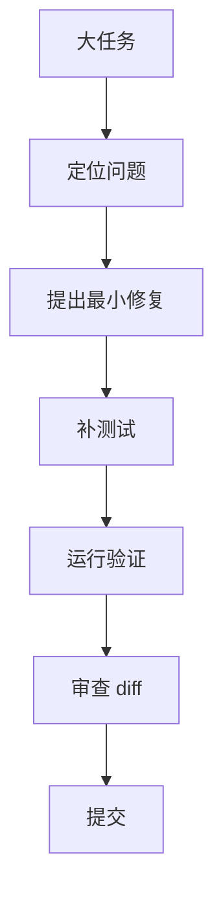
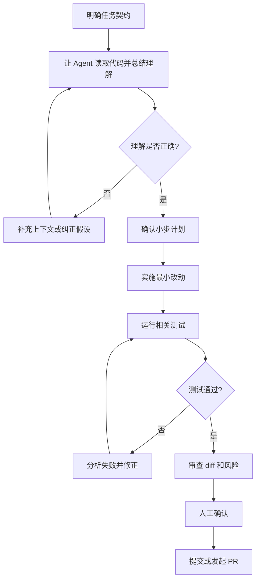
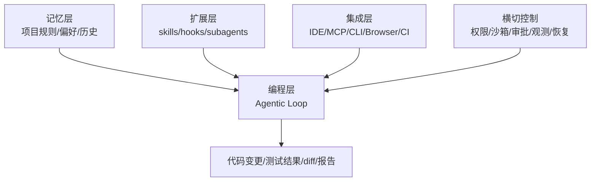

# Agentic Loop 与 Java 后端实践

检查日期：2026-07-05 Asia/Shanghai

本文解释 Agentic Loop 的含义、工作方式、最佳实践，以及 Java 后端工程师如何在日常工作中使用它。

## 定义

Agentic Loop 是 agent 在 harness 中反复执行的工作循环：

```text
观察 -> 判断 -> 行动 -> 读取结果 -> 修正 -> 验证
```

它和一次性问答的区别在于：模型不是只生成一个回答，而是在 harness 提供的工具、上下文、权限和验证机制中持续行动，直到任务完成、失败或被人中断。



在本 workspace 的模型中：

```text
Agent = Model + Harness
```

Model 负责推理、规划和决定下一步。Harness 负责把下一步变成真实行动：读文件、搜索代码、运行命令、编辑文件、调用 MCP、执行测试、记录日志、请求审批和保留证据。

## 工作机制

一次典型 coding agent loop 是：

1. 用户给出目标、上下文、约束和完成标准。
2. Agent 读取代码、日志、测试、配置和文档。
3. Model 判断下一步行动。
4. Harness 执行工具调用，例如读文件、改代码、运行测试或调用外部系统。
5. 工具结果回到上下文。
6. Model 根据结果调整计划。
7. 循环继续，直到通过验证或遇到阻塞。
8. Agent 输出变更摘要、验证结果、风险和后续建议。



## 最佳实践

### 任务契约优先

不要只说“帮我优化一下”。把任务写成工程契约：

```text
目标：修复订单支付成功后状态偶发未更新的问题。
上下文：错误日志、相关接口、可疑服务类、数据库表。
约束：不修改对外 API；保持最小改动；兼容已有状态流转。
完成标准：解释根因；新增回归测试；运行相关测试通过；说明剩余风险。
```

好的 Agentic Loop 依赖清晰的 done criteria。没有完成标准，agent 只能产出“看似合理”的结果。

### 先理解，再修改

复杂任务不要让 agent 直接改代码。先要求它：

1. 读取相关代码。
2. 复述调用链和关键假设。
3. 列出计划。
4. 等你确认后再实施。

这能降低误改边界、误解业务语义和过度重构的风险。

### 小步循环

把大任务拆成多个可验证循环：



每个循环都要有明确输入和输出。不要让 agent 在一个长循环里同时做需求澄清、架构调整、编码、测试、文档和提交。

### 验证必须成为交付物

最终回复应包含：

- 改了哪些文件。
- 为什么这样改。
- 运行了哪些验证命令。
- 验证结果是什么。
- 哪些验证没有运行，原因是什么。
- 剩余风险是什么。

对 Java 后端来说，常见验证包括：

- `mvn test`
- `mvn -pl <module> test`
- `mvn -Dtest=SomeTest test`
- `./gradlew test`
- `./gradlew :module:test`
- `mvn verify`
- `mvn spotless:check`
- `mvn checkstyle:check`
- `mvn -DskipTests compile`

### 人负责边界，Agent 负责执行

Agent 擅长高频执行：读代码、找引用、改样板、补测试、跑命令、总结 diff。工程师仍应负责：

- 业务语义判断。
- 事务边界。
- 并发和一致性。
- 安全和权限。
- 数据迁移。
- 对外 API 兼容。
- 性能和容量假设。
- 发布风险。

## Java 后端日常实践场景

### Bug 修复

适用：线上错误、测试失败、状态不一致、异常栈定位。

推荐提示：

```text
Bug：订单支付成功后偶发没有更新状态。

上下文：
- 错误日志如下：...
- 相关模块：order-service
- 可疑类：PaymentCallbackController、OrderPaymentService

要求：
1. 先定位调用链和事务边界，不要直接改代码。
2. 找出最可能根因和证据。
3. 给出最小修复方案。
4. 补一个回归测试。
5. 运行最小相关测试。

约束：
- 不修改对外 API。
- 不改变已有订单状态枚举语义。
- 不做无关重构。
```

### 新增接口

适用：REST API、RPC 方法、内部管理接口。

推荐提示：

```text
我要新增一个查询用户订单摘要的 REST API。

请先阅读现有 Controller、Service、Repository 分层风格。

约束：
- 保持现有 DTO 命名和异常处理风格。
- 不修改已有接口。
- 权限校验位置要和现有接口一致。

完成标准：
- Controller、DTO、Service、测试齐全。
- 说明异常处理、权限校验和分页策略。
- 运行相关测试。
```

### 重构

适用：重复逻辑、过长方法、状态流转混乱、可读性差。

推荐提示：

```text
请重构 PaymentService 中重复的状态流转逻辑。

要求：
1. 先列出现有分支和行为。
2. 判断现有测试是否覆盖关键路径。
3. 提出小步重构计划。
4. 保持行为不变。
5. 每一步都能通过相关测试。

不要：
- 不要改数据库 schema。
- 不要改变 public method signature。
- 不要引入新框架。
```

### 测试补齐

适用：遗留服务、边界条件、回归测试。

推荐提示：

```text
请为 RefundService 补充单元测试。

重点覆盖：
- 重复退款。
- 余额不足。
- 第三方超时。
- 事务回滚。
- 幂等 key 冲突。

不要改生产代码，除非发现明显 bug。若需要改生产代码，先说明原因。
```

### 代码审查

适用：提交前自查、PR review、风险扫描。

推荐提示：

```text
请 review 当前未提交改动。

重点看：
- 事务边界。
- 并发问题。
- 空指针。
- 异常吞噬。
- API 兼容性。
- 权限校验。
- 测试缺口。

请按严重程度排序，只列真实风险，不要泛泛而谈。
```

### 日志与可观测性改进

适用：线上问题难定位、缺 trace id、日志缺关键字段。

推荐提示：

```text
请检查 OrderService 的关键路径日志。

目标：
- 增加排查支付状态不一致所需的最小日志。
- 日志必须包含 orderId、paymentId、state transition、traceId。

约束：
- 不打印手机号、token、身份证、银行卡等敏感信息。
- 不改变业务逻辑。
- 保持现有 logging 风格。
```

## 日常工作流

推荐 Java 后端工程师采用这个流程：



## 风险边界

以下任务可以更多交给 agent 执行：

- 查找调用链。
- 解释模块职责。
- 补单元测试。
- 改小 bug。
- 补日志。
- 生成迁移前的影响分析。
- 写 PR 描述。
- 做提交前 diff review。

以下任务必须加强人工把关：

- 数据库迁移。
- 金融、支付、权限、安全相关逻辑。
- 分布式事务和消息一致性。
- 并发控制和锁。
- 大规模重构。
- 性能关键路径。
- 发布脚本、基础设施和生产配置。

## 与四层架构的关系

Agentic Loop 主要发生在编程层，但依赖其他层支撑：



记忆层提供背景，扩展层提供可复用流程，集成层提供外部工具和数据，横切控制保证安全和可审计。编程层把这些能力组织成实际的软件工程循环。

## 实践检查表

每次使用 Agentic Loop 前，快速检查：

| 项 | 问题 |
| --- | --- |
| 目标 | 我是否说明了要改变什么行为？ |
| 上下文 | 我是否提供了相关文件、日志、接口或错误信息？ |
| 约束 | 我是否说明了不能改什么？ |
| 验证 | 我是否定义了完成标准和测试命令？ |
| 权限 | 这次任务是否允许 agent 改文件、跑命令、访问网络？ |
| 风险 | 是否涉及数据、支付、安全、权限、并发或发布？ |
| 证据 | 最终是否需要测试输出、diff 摘要或风险说明？ |

## 相关文档

- [Harness 原则](./harness-principles.md)
- [四层 Harness 架构模型](./four-layer-harness-architecture.md)
- [Coding Agent Harness 比较](./coding-agent-harness-comparison.md)
