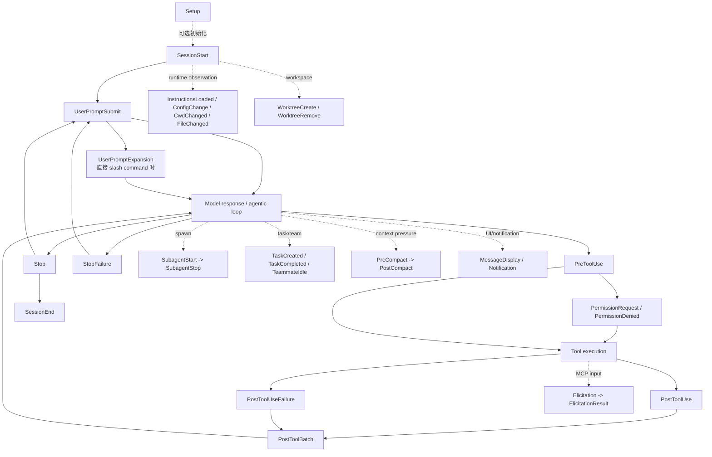
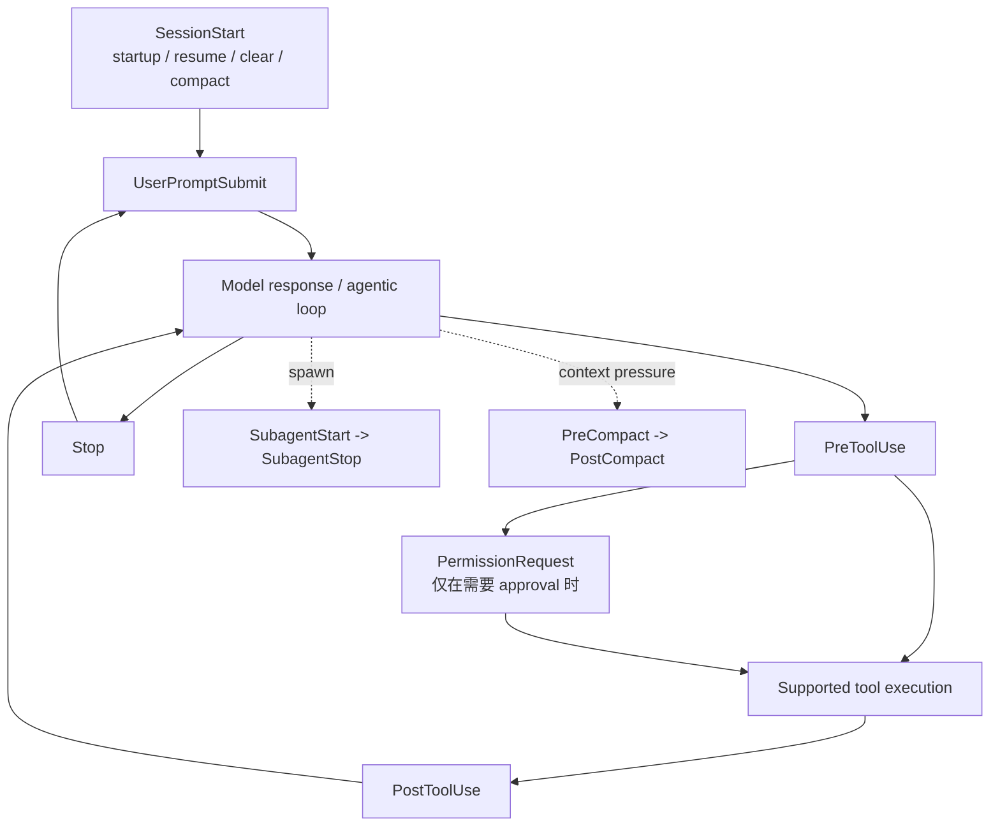

# Claude Code 与 Codex 的 Hook 事件生命周期对比

会话汇总与执行底座方法论见：[Claude Code Hooks：从生命周期扩展点到可执行硬约束](./claude-code-hooks-execution-foundation.md)。

检查日期：2026-07-12 Asia/Shanghai

本文比较的是 Claude Code 和 Codex **公开 hook contract 暴露的生命周期事件**，不是产品内部的全部 telemetry、UI notification、App Server event 或 API stream event。事件数量和能力以检查日的官方文档为准。

## 结论摘要

1. Codex 当前公开的 10 个 hook 事件全部能在 Claude Code 中找到同名事件：`SessionStart`、`UserPromptSubmit`、`PreToolUse`、`PermissionRequest`、`PostToolUse`、`SubagentStart`、`SubagentStop`、`Stop`、`PreCompact`、`PostCompact`。
2. Claude Code 当前公开 30 个 hook 事件。除上述共同主干外，它还覆盖 setup/session end、slash command expansion、tool failure/batch、task/team、instruction/config/file/cwd、worktree、notification、message display 和 MCP elicitation。
3. 两者的 hooks 都能做 context injection、工具调用前治理、approval automation、工具调用后反馈、停止前验证和 compaction 协调；同名事件不代表完全相同的输入、输出和控制能力。
4. Claude Code 的 handler 形态更丰富：支持 command、HTTP、MCP tool、prompt 和 agent hooks，并支持异步 command hooks。Codex 当前只有 `type: "command"` 真正执行；`prompt`、`agent` 和 `async` 配置虽可被解析，但会被跳过。
5. hooks 不应被当作唯一安全边界。Claude Code 明确称 `if` 过滤是 best-effort；Codex 明确称 `PreToolUse` 是 guardrail，当前不能覆盖所有 shell 和非 shell 工具路径。强约束仍应由 sandbox、permissions/approval policy 和 managed policy 承担。

## 生命周期模型

### Claude Code

这张图是用于比较的归纳图，不表示所有分支都严格串行。例如 `Notification`、`ConfigChange` 和 `FileChanged` 是旁路事件，parallel tool calls 的 `PostToolUse` 也可能并发触发。

### Codex

Codex 文档把 `PreToolUse`、`PermissionRequest`、`PostToolUse`、`PreCompact`、`PostCompact`、`UserPromptSubmit`、`SubagentStop` 和 `Stop` 归为 turn scope；`SessionStart` 与 `SubagentStart` 位于 thread 或 subagent-start scope。

## 完整事件矩阵

| 类别 | Claude Code | Codex | 主要用途 |
| --- | --- | --- | --- |
| Session/setup | `Setup`、`SessionStart`、`SessionEnd` | `SessionStart` | 初始化、恢复上下文、准备环境、清理或审计结束 |
| Prompt/turn | `UserPromptSubmit`、`UserPromptExpansion`、`Stop`、`StopFailure` | `UserPromptSubmit`、`Stop` | prompt 扫描与补充、slash command 治理、完成门禁、失败观测 |
| Tool/approval | `PreToolUse`、`PermissionRequest`、`PermissionDenied`、`PostToolUse`、`PostToolUseFailure`、`PostToolBatch` | `PreToolUse`、`PermissionRequest`、`PostToolUse` | 调用前策略、approval 自动化、调用后检查、失败归因、批次级反馈 |
| Subagent/task/team | `SubagentStart`、`SubagentStop`、`TaskCreated`、`TaskCompleted`、`TeammateIdle` | `SubagentStart`、`SubagentStop` | 子智能体上下文与完成门禁、任务状态约束、团队 idle 控制 |
| Compaction | `PreCompact`、`PostCompact` | `PreCompact`、`PostCompact` | 压缩前保存状态、压缩后恢复或注入上下文 |
| Instructions/runtime | `InstructionsLoaded`、`ConfigChange`、`CwdChanged`、`FileChanged` | 无公开 hook 事件 | instruction 加载审计、配置变更控制、目录和文件变化响应 |
| Worktree | `WorktreeCreate`、`WorktreeRemove` | 无公开 hook 事件 | 自定义 worktree 创建与清理 |
| MCP elicitation | `Elicitation`、`ElicitationResult` | 无公开 hook 事件 | 代答、修改、拒绝 MCP server 的中途输入请求 |
| UI/notification | `Notification`、`MessageDisplay` | 无公开 hook 事件 | 外部通知、显示内容观察或处理 |

按官方表格计数，Claude Code 为 30 个，Codex 为 10 个。这个计数只表达 hook surface 的宽度，不直接说明可靠性或产品总体能力。

## 同名事件的关键差异

| 事件 | Claude Code | Codex |
| --- | --- | --- |
| `SessionStart` | 可按 `startup`、`resume`、`clear`、`compact` 匹配；可注入 context，并可通过 `CLAUDE_ENV_FILE` 为后续 Bash 持久设置环境变量。 | 同样按 `startup`、`resume`、`clear`、`compact` 匹配；stdout 或 `additionalContext` 进入 developer context。 |
| `UserPromptSubmit` | 可补充 context 或阻止 prompt；还另有 `UserPromptExpansion` 管理直接输入的 slash commands。 | 可补充 developer context 或阻止 prompt；当前不支持 matcher。 |
| `PreToolUse` | 覆盖 Claude Code 工具和 MCP tools；可 `allow`、`deny`、`ask`、`defer`，并可改写 input。 | 当前拦截简单 shell/Bash、`apply_patch` 和 MCP tools；可 deny，或以 `allow + updatedInput` 改写。`ask` 尚不支持；`unified_exec`、`WebSearch` 等路径覆盖不完整。 |
| `PermissionRequest` | 可 allow/deny；allow 可带 `updatedInput`、`updatedPermissions`，deny 可带 message/interrupt。allow 仍不能越过匹配的 deny rule。 | 可 allow/deny/不决策；不决策时进入正常 approval UI。多个 hook 中 deny 优先；`updatedInput`、`updatedPermissions`、`interrupt` 尚不支持。 |
| `PostToolUse` | 仅表示成功；失败由 `PostToolUseFailure` 单独表示，parallel batch 结束后还有 `PostToolBatch`。可补充反馈或替换 tool output。 | 对支持的工具在产出 output 后触发，Bash 非零退出也在此处理；没有公开的 failure/batch hook。不能撤销副作用，且 output replacement 字段尚未实现。 |
| `SubagentStart` | 可为 subagent 注入 context；`SubagentStop` 可阻止其停止。 | 可注入 subagent developer context，但 `continue: false` 不能阻止 subagent 启动；`SubagentStop` 可要求继续一次 subagent flow。 |
| `Stop` | 可阻止 Claude 停止并把原因反馈给 Claude；可用 command、prompt 或 agent verifier 实现完成门禁。 | `decision: "block"` 会创建一个以 reason 为内容的新 continuation prompt；当前 handler 只能是 command。 |
| `PreCompact` / `PostCompact` | 同时提供压缩前后观察点，适合保存状态和重新注入动态上下文；静态规则仍应放在 `CLAUDE.md`。 | 两个事件都可按 `manual`/`auto` 匹配；`continue: false` 可分别在压缩前停止或在压缩后停止后续处理。 |

## Hooks 能起到的作用

| 作用 | 典型事件 | 示例 | 控制强度 |
| --- | --- | --- | --- |
| 动态 context injection | `SessionStart`、`UserPromptSubmit`、`PostToolUse`、`SubagentStart` | 注入当前 issue、目录约束、生成文件说明 | 软约束；模型仍需理解并遵循 |
| Prompt 数据防泄漏 | `UserPromptSubmit` | 在送入模型前检测 API key、token 或受限内容 | 可阻断，但检测器质量决定覆盖率 |
| 工具调用前治理 | `PreToolUse` | 禁止破坏性命令、保护文件、改写参数 | 适合 defense in depth；不是完整 sandbox |
| Approval automation | `PermissionRequest` | 对已验证的低风险命令自动批准，对越权请求拒绝 | 能减少人工打断；不能替代 permission policy |
| 自动格式化与反馈 | `PostToolUse` | 编辑后 format/lint，把结果反馈给 agent | 副作用已经发生，不能回滚原调用 |
| 完成条件门禁 | `Stop`、`SubagentStop`、Claude Code 的 `TaskCompleted` | 测试未通过或 artifact 缺失时要求继续 | 对“过早宣布完成”有效，需防无限循环 |
| Compaction 连续性 | `PreCompact`、`PostCompact` | 保存任务状态、压缩后恢复动态摘要 | 补充 context management，不代替提交到仓库的规则 |
| 审计与通知 | tool、session、config、notification events | 记录 event、命令、退出码，发送外部通知 | 多为观察用途，不一定能阻断 |
| 运行环境联动 | Claude Code 的 `Setup`、`CwdChanged`、`FileChanged` | 激活环境、更新 watch list、响应 `.envrc` | Claude Code 当前覆盖更完整 |

## Handler 与配置能力

| 维度 | Claude Code | Codex |
| --- | --- | --- |
| 当前可执行 handler | `command`、`http`、`mcp_tool`、`prompt`、`agent`；具体事件支持的类型不同 | 仅 `command`；`prompt`、`agent` 被解析但跳过 |
| 异步 | command hook 支持 `async`；异步结果不能阻断已经继续的动作 | `async` 被解析但当前不支持，handler 会被跳过 |
| 配置位置 | user、project、local、managed policy、plugin，以及 skill/agent frontmatter | user/project 的 `hooks.json` 或 `config.toml`、managed `requirements.toml`、plugin |
| Trust | command hooks 以当前用户权限执行；应只启用受信代码 | 非 managed command hook 按定义 hash 审查和信任；变更后需要重新 review |
| 并发 | 所有 matching hooks 并行运行，相同 handler 自动去重 | 同一事件的 matching command hooks 并发启动 |
| 输入 | 公共 JSON 加 event-specific fields；command 走 stdin，HTTP 走 POST body | 每个 command hook 从 stdin 接收一个 JSON object；transcript 格式不是稳定接口 |

## 边界与风险

### 观察结果

- `PreToolUse` 发生在副作用之前，适合 deny 或 rewrite；`PostToolUse` 发生在副作用之后，只能反馈、补救或停止后续处理。
- hook 的“block”语义随事件变化。对 `Stop` 来说通常表示继续工作，对 `PostToolUse` 来说不表示回滚，对纯观察事件则可能没有控制效果。
- matching hooks 并发执行，因此 hooks 不应依赖彼此的启动顺序；共享文件或外部状态需要锁、幂等键或原子操作。
- Claude Code command hooks 以系统用户完整权限运行。Codex 的 hash trust 用于确认 hook 定义经过审查，不等于对脚本行为的安全证明；其实际 OS 边界仍需结合运行环境单独验证。
- Codex 官方文档明确指出当前 tool interception 不完整。即使 Claude Code 的覆盖更广，其 `if` filter 也是 best-effort，官方建议使用 permission system 实施硬 allow/deny。

### 建议

1. 把 sandbox、permissions/approval policy 和 managed policy 作为安全边界；把 hooks 作为上下文适配、自动化和 defense in depth。
2. 对密钥扫描、路径规则和命令 allow/deny 使用确定性 command hook；需要语义判断时，Claude Code 才考虑 prompt/agent hook，并将其视为概率性 verifier。
3. 将昂贵验证放在 `Stop`，将快速局部检查放在 `PostToolUse`；避免每次 tool call 都运行完整测试套件。
4. 为 `Stop`/`SubagentStop` 设置重入标记或最多重试次数，避免验证失败造成无限 continuation loop。
5. hook 脚本应有超时、幂等性、结构化日志和最小输出；不要解析未承诺稳定的 transcript 内部格式作为长期契约。
6. 升级客户端后重新核对事件表和 output schema。Codex 文档特别提醒 GitHub `main` schema 可能领先当前 release，应以 release behavior 页面为准。

## 可复核范围与限制

本次是文档契约审计，没有创建运行时实验：

- Claude Code 官方 hooks reference 在 2026-07-12 列出 30 个事件；本机未安装 `claude` CLI，因此没有核对具体本地版本的触发日志。
- 本机 `codex-cli 0.144.1` 可用，但没有为本次总结修改项目 hooks 或执行副作用探针；Codex 事件与限制来自检查日官方 release behavior 页面。
- 官方页面会持续更新；这里没有把内部事件、尚未实现的 schema 字段或产品 UI event 当作可用 hook 能力。

## 官方来源

- Claude Code `hookSpecificOutput` 协议详解：[本地文档](./claude-code-hook-output-protocol.md)
- Claude Code Hooks reference：https://code.claude.com/docs/en/hooks
- Claude Code Automate actions with hooks：https://code.claude.com/docs/en/hooks-guide
- Claude Code Permissions：https://code.claude.com/docs/en/permissions
- Codex Hooks：https://developers.openai.com/codex/hooks
- Codex Agent approvals and security：https://developers.openai.com/codex/agent-approvals-security
