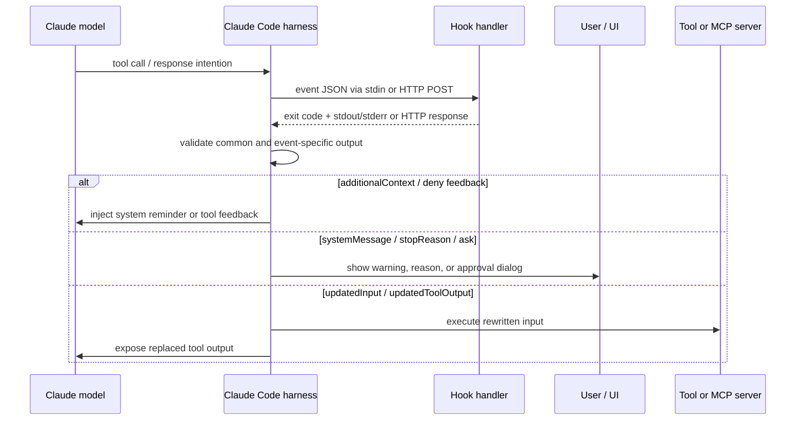

# Claude Code Hook 输出协议：`hookSpecificOutput`

会话汇总与执行底座方法论见：[Claude Code Hooks：从生命周期扩展点到可执行硬约束](./claude-code-hooks-execution-foundation.md)。

检查日期：2026-07-12 Asia/Shanghai

本文解释 Claude Code lifecycle hook 如何与 Claude Code harness 通信，重点是官方字段 `hookSpecificOutput`。常见拼写错误是 `hookSpecificOuput`，缺少 `t`；错误拼写不会被识别为事件专用输出，并可能因 output validation 被报告为无效返回。

## 核心定义

`hookSpecificOutput` 不是 hook 与 Claude 模型之间的直接 RPC，也不等同于一条 chat message。它是 hook 返回给 **Claude Code harness** 的事件专用 JSON envelope：

1. Claude Code 在 lifecycle event 发生时，把 event JSON 发送给 hook。
2. Hook 检查输入并返回退出码、文本或结构化 JSON。
3. Claude Code 验证返回值，根据 event schema 执行 allow、deny、rewrite、context injection 等动作。
4. 只有特定字段会被送入 Claude 的 context；另一些字段只影响 UI、permission engine、tool executor 或 MCP flow。



因此，更准确的表述是：

```text
Hook <-> Claude Code harness <-> Claude model / user / tool
```

而不是：

```text
Hook <-> Claude model
```

## 传输层

### Command hook

- Claude Code 向进程 `stdin` 写入一个 JSON object。
- Hook 用 exit code、`stdout` 和 `stderr` 返回结果。
- Exit `0`：成功；如果 `stdout` 是 JSON，Claude Code 解析结构化字段。
- Exit `2`：blocking error；`stderr` 是反馈文本，具体阻断效果取决于事件。
- 其他非零退出码：对大多数事件是 non-blocking hook error，主流程继续。
- 若 exit `2`，`stdout` 中的 JSON 会被忽略。不能同时使用“exit 2 阻断”和“exit 0 + JSON 决策”。

### HTTP hook

- Claude Code 用 `Content-Type: application/json` 向 endpoint POST 同一份 event JSON。
- 2xx + empty body 相当于 command hook 的 exit `0` 且无输出。
- 2xx + JSON body 使用相同的结构化输出 schema。
- Non-2xx、连接失败或 timeout 默认是 non-blocking error。
- HTTP status 本身不能表达 blocking decision；要阻断，必须返回 2xx 和合法 JSON decision。

### MCP tool hook

MCP tool 的 text output 按 command hook 的 `stdout` 规则处理。它同样需要返回符合触发事件的 output schema。

### Prompt/agent hook

Prompt 和 agent handlers 通常返回 `{ "ok": true }` 或 `{ "ok": false, "reason": "..." }`，由 Claude Code 映射为对应事件的 decision。它们不是任意 `hookSpecificOutput` producer；需要精确字段控制时，优先使用 command hook。

### Async command hook

异步 hook 返回时，触发动作通常已经继续，因此 `decision`、`permissionDecision` 和 `continue` 不能再控制该动作。异步结果中的 `additionalContext` 最早在后续 turn 交付。

## 输入与输出命名

输入 event 使用 snake_case：

```json
{
  "session_id": "abc123",
  "transcript_path": "/path/to/transcript.jsonl",
  "cwd": "/repo",
  "permission_mode": "default",
  "hook_event_name": "PreToolUse",
  "tool_name": "Bash",
  "tool_input": {
    "command": "npm test"
  },
  "tool_use_id": "toolu_01..."
}
```

输出中的事件鉴别字段使用 camelCase，并位于 `hookSpecificOutput` 内：

```json
{
  "hookSpecificOutput": {
    "hookEventName": "PreToolUse"
  }
}
```

必须注意：

- 输入是 `hook_event_name`。
- 输出是 `hookSpecificOutput.hookEventName`。
- `hookEventName` 应与当前触发事件精确一致，例如 `PreToolUse`，不能填写 matcher、tool name 或自定义名称。
- `hookSpecificOutput` 的其他字段由 `hookEventName` 选择的 event schema 决定，不是任意 key-value bag。

## 完整输出分层

一个概念上的完整 envelope 如下，但不能假设所有字段都适用于所有事件：

```json
{
  "continue": true,
  "stopReason": "optional user-facing reason",
  "suppressOutput": false,
  "systemMessage": "optional user-facing warning",
  "decision": "block",
  "reason": "event-specific feedback",
  "hookSpecificOutput": {
    "hookEventName": "PreToolUse",
    "additionalContext": "event-specific context"
  }
}
```

输出分为三层：

| 层 | 字段 | 作用 |
| --- | --- | --- |
| 通用控制 | `continue`、`stopReason`、`suppressOutput`、`systemMessage` | 控制整个 hook 处理、debug output 和用户提示 |
| 顶层事件决策 | `decision`、`reason` | 对部分事件表达 `block` 与反馈 |
| 事件专用输出 | `hookSpecificOutput` | 承载某一 event 的 context、permission、rewrite 或特殊返回值 |

### 通用字段

| 字段 | 默认值 | 消费者 | 语义 |
| --- | --- | --- | --- |
| `continue` | `true` | Claude Code harness | `false` 表示完全停止后续处理，并优先于 event-specific decision。它不是“让 Claude 继续工作”的开关。 |
| `stopReason` | 无 | 用户 | 配合 `continue: false` 显示停止原因，不提供给 Claude。 |
| `suppressOutput` | `false` | Debug/logging | 从 debug log 隐藏 stdout。 |
| `systemMessage` | 无 | 用户/UI | 显示 warning，不进入 Claude context。 |

最容易混淆的是 `continue: false`：

- 要让 `Stop` hook 告诉 Claude “继续工作”，使用顶层 `decision: "block"` 和 `reason`。
- 使用 `continue: false` 会停止 Claude Code 的后续处理，效果相反。

## 三种主要决策协议

### 顶层 `decision`

以下事件使用顶层 `decision: "block"` 和 `reason`：

- `UserPromptSubmit`
- `UserPromptExpansion`
- `PostToolUse`
- `PostToolUseFailure`
- `PostToolBatch`
- `Stop`
- `SubagentStop`
- `ConfigChange`
- `PreCompact`

```json
{
  "decision": "block",
  "reason": "Test suite must pass before proceeding"
}
```

同一个 `block` 在不同事件中含义不同：

- `UserPromptSubmit`：拒绝处理并从 context 中移除该 prompt；`reason` 显示给用户。
- `PostToolUse`：工具已经运行；不能回滚，只把反馈交给 Claude。
- `Stop`：阻止 Claude 停止，`reason` 成为 Claude 的下一条工作指令。
- `PreCompact`：阻止本次 compaction。

### `PreToolUse` 的 `permissionDecision`

`PreToolUse` 不应再使用旧的顶层 `decision`。当前协议是：

```json
{
  "hookSpecificOutput": {
    "hookEventName": "PreToolUse",
    "permissionDecision": "deny",
    "permissionDecisionReason": "Database writes are not allowed",
    "additionalContext": "The current deployment target is production."
  }
}
```

| 字段 | 取值/类型 | 语义 |
| --- | --- | --- |
| `permissionDecision` | `allow` | 跳过普通 permission prompt；deny/ask rules 仍会继续评估。 |
|  | `deny` | 阻止 tool call。 |
|  | `ask` | 把 tool call 提交给用户确认。 |
|  | `defer` | 暂停该 tool call，允许以后恢复。 |
| `permissionDecisionReason` | string | `deny` 时交给 Claude；`allow`/`ask` 时显示给用户；`defer` 时忽略。 |
| `updatedInput` | object | 替换完整 tool input，不是 merge patch；必须保留未修改字段。 |
| `additionalContext` | string | 在该工具结果附近加入 Claude context；`defer` 时忽略。 |

多个 `PreToolUse` hooks 决策冲突时，优先级是：

```text
deny > defer > ask > allow
```

允许并改写 Bash command：

```json
{
  "hookSpecificOutput": {
    "hookEventName": "PreToolUse",
    "permissionDecision": "allow",
    "permissionDecisionReason": "Use the repository-scoped test target",
    "updatedInput": {
      "command": "npm test -- --runInBand",
      "description": "Run repository tests serially"
    }
  }
}
```

`updatedInput` 替换整个 input object。若原调用还包含 timeout、background flag 或其他必要字段，hook 必须一并复制。

### `PermissionRequest` 的嵌套 `decision`

`PermissionRequest` 也使用 `hookSpecificOutput`，但其 `decision` 又嵌套一层：

```json
{
  "hookSpecificOutput": {
    "hookEventName": "PermissionRequest",
    "decision": {
      "behavior": "allow",
      "updatedInput": {
        "command": "npm run lint"
      }
    }
  }
}
```

| 字段 | 适用行为 | 语义 |
| --- | --- | --- |
| `behavior` | `allow` / `deny` | 代表用户批准或拒绝 permission request。 |
| `updatedInput` | `allow` | 替换整个 tool input，随后重新评估 deny/ask rules。 |
| `updatedPermissions` | `allow` | 添加、替换或移除 permission rules，可写入 local/project/user settings。 |
| `message` | `deny` | 告诉 Claude 拒绝原因。 |
| `interrupt` | `deny` | `true` 时除拒绝当前请求外还停止 Claude。 |

即使 hook 返回 `allow`，也不能越过现有 deny rule；permission system 的 deny/ask 仍会评估。

拒绝示例：

```json
{
  "hookSpecificOutput": {
    "hookEventName": "PermissionRequest",
    "decision": {
      "behavior": "deny",
      "message": "Production deployment requires a human operator.",
      "interrupt": false
    }
  }
}
```

## `hookSpecificOutput` 字段地图

| 事件 | 事件专用字段 | 路由效果 |
| --- | --- | --- |
| `SessionStart`、`Setup` | `additionalContext` | 在首个 prompt 前加入 Claude context。 |
| `UserPromptSubmit` | `additionalContext`、`sessionTitle` | 与用户 prompt 一起注入 context；设置 UI session title。阻断仍使用顶层 `decision`。 |
| `UserPromptExpansion` | `additionalContext` | 与展开后的 slash command prompt 一起进入 context。阻断使用顶层 `decision`。 |
| `SubagentStart` | `additionalContext` | 在 subagent 开始时注入其 context。 |
| `PreToolUse` | `permissionDecision`、`permissionDecisionReason`、`updatedInput`、`additionalContext` | 工具调用前 allow/deny/ask/defer、改写 input 或补充 context。 |
| `PermissionRequest` | `decision.behavior`、`updatedInput`、`updatedPermissions`、`message`、`interrupt` | 代用户处理 approval request。 |
| `PermissionDenied` | `retry` | `true` 时告诉 Claude 可以重试已被 auto mode 拒绝的 tool call。 |
| `PostToolUse` | `additionalContext`、`updatedToolOutput`、`updatedMCPToolOutput` | 补充 context 或替换 Claude 将看到的 tool output；不能撤销副作用。 |
| `PostToolUseFailure`、`PostToolBatch` | `additionalContext` | 在失败结果或整个 parallel batch 后补充 context。 |
| `CwdChanged` | `watchPaths` | 更新 `FileChanged` 的动态绝对路径 watch list；不能阻止 `cwd` 变化。 |
| `WorktreeCreate` HTTP hook | `worktreePath` | 返回新 worktree 的绝对路径；command hook 则直接在 stdout 输出路径。 |
| `Elicitation`、`ElicitationResult` | `action`、`content` | 接受、拒绝、取消或改写 MCP elicitation/response。 |

`Stop`、`SubagentStop`、`ConfigChange` 和 `PreCompact` 的主要控制字段是顶层 `decision`，不能为了结构“统一”而把它们错误地塞入 `hookSpecificOutput`。

## 什么内容真正进入 Claude context

### `additionalContext`

`additionalContext` 是最直接的 model-visible channel。Claude Code 会把它包装为 system reminder，并插入事件对应位置：

- `SessionStart`、`Setup`、`SubagentStart`：首个 prompt 之前。
- `UserPromptSubmit`、`UserPromptExpansion`：对应 prompt 旁边。
- `PreToolUse`、`PostToolUse`、`PostToolUseFailure`、`PostToolBatch`：tool result 附近。

```json
{
  "hookSpecificOutput": {
    "hookEventName": "PostToolUse",
    "additionalContext": "This file is generated. Edit src/schema.ts and run bun generate instead."
  }
}
```

同一事件的多个 hooks 返回 `additionalContext` 时，Claude 会收到全部值。单个 context output 超过 10,000 characters 时，Claude Code 会把完整内容保存到 session directory，并向 Claude 提供 preview 和 file path。

动态 context 会写入 transcript。恢复 session 时，过去 turn 的 hooks 不会重新执行，而是重放已保存文本，因此 timestamp、branch HEAD、CI status 等可能过期。`SessionStart` 会在 resume 时再次触发，适合刷新动态状态。

### 不是 model-visible context 的字段

| 字段 | 默认接收方 |
| --- | --- |
| `systemMessage` | 用户/UI |
| `stopReason` | 用户/UI |
| `sessionTitle` | UI/session metadata |
| `permissionDecisionReason` with `allow`/`ask` | 用户/UI |
| `updatedInput` | Tool executor / permission engine |
| `watchPaths` | File watcher |
| `suppressOutput` | Debug logger |

不要用 `systemMessage` 向 Claude 下指令；Claude 看不到它。不要用 `stopReason` 代替 `Stop.reason`；前者给用户，后者才会驱动 Claude 继续工作。

## `PostToolUse` 输出替换

```json
{
  "hookSpecificOutput": {
    "hookEventName": "PostToolUse",
    "additionalContext": "Sensitive output was redacted before model delivery.",
    "updatedToolOutput": {
      "stdout": "[redacted]",
      "stderr": "",
      "interrupted": false,
      "isImage": false
    }
  }
}
```

约束：

- Tool 已经执行，files、network requests 和其他副作用不会被撤销。
- `updatedToolOutput` 只改变 Claude 看到的结果。
- Built-in tool replacement 必须匹配该 tool 的 output shape，否则会被忽略并回退到原输出。
- MCP output 不做同样的 built-in schema validation。
- Telemetry 可能已经记录原始输出，因此它不是 telemetry redaction boundary。

## `Stop` 的正确协议

让 Claude 继续：

```json
{
  "decision": "block",
  "reason": "Unit tests are still failing. Fix them and run the focused suite again."
}
```

完全停止 Claude Code 后续处理：

```json
{
  "continue": false,
  "stopReason": "External policy service is unavailable."
}
```

两者不能混淆。`Stop` event 的“block”指阻止停止，所以会继续；通用字段 `continue: false` 指终止整个处理流程。

## 常见错误

1. 拼成 `hookSpecificOuput`，字段不会被识别，并可能触发 output validation error。
2. 把输入的 `hook_event_name` 原样用在输出中；输出必须是 `hookEventName`。
3. 在 exit `2` 时输出 JSON；Claude Code 只读取 `stderr`，JSON 被忽略。
4. `stdout` 在 JSON 前后混入 debug text、shell profile output 或多段 JSON，导致解析失败。
5. 对 `Stop` 使用 `continue: false`，本意是要求继续，实际却终止处理。
6. 对 `PreToolUse` 使用已废弃的顶层 `decision: "approve"/"block"`，而不是 `permissionDecision`。
7. 把 `updatedInput` 当成 merge patch，遗漏原始 input 的必要字段。
8. 在 `PostToolUse` 里试图阻止已经发生的文件、shell 或网络副作用。
9. 用 `systemMessage` 给 Claude 提示；它只显示给用户。
10. 解析 `transcript_path` 指向文件的内部格式并把它当成稳定 API；官方只承诺路径便利性，不承诺 transcript schema 长期稳定。
11. 把外部系统返回的未验证文本直接放进 `additionalContext`，引入 prompt injection 或错误指令。

## 最小 command hook 示例

配置：

```json
{
  "hooks": {
    "PreToolUse": [
      {
        "matcher": "Bash",
        "hooks": [
          {
            "type": "command",
            "command": "${CLAUDE_PROJECT_DIR}/.claude/hooks/check-bash.sh"
          }
        ]
      }
    ]
  }
}
```

Handler：

```bash
#!/usr/bin/env bash
set -euo pipefail

input=$(cat)
command=$(jq -r '.tool_input.command // ""' <<<"$input")

if [[ "$command" == *"rm -rf"* ]]; then
  jq -n '{
    hookSpecificOutput: {
      hookEventName: "PreToolUse",
      permissionDecision: "deny",
      permissionDecisionReason: "Destructive recursive deletion is blocked."
    }
  }'
fi
```

安全路径不输出任何内容并 exit `0`，让正常 permission flow 继续。阻断路径同样 exit `0`，但以唯一的 stdout JSON 返回结构化 deny decision。

## 调试与验证

- 使用 `claude --debug-file <path>`，或 `claude --debug` 后检查 `~/.claude/debug/<session-id>.txt`。
- 记录 event name、matcher 是否命中、hook exit code，以及完整 stdout/stderr。
- 为每个 handler 保存脱敏 input fixture，单独测试 JSON output。
- 验证三类结果：Claude 实际看见的 context、用户 UI 显示的消息、tool/permission 是否真的被控制。
- 对 `Stop`、`SubagentStop` 和 `UserPromptSubmit` 增加重入保护，避免 hook 自身触发无限循环。

## 官方来源

- 可运行工程实践：[安全、代码质量与子智能体上下文 hooks](../experiments/2026-07-12-claude-code-hooks-engineering/README.md)
- Claude Code Hooks reference：https://code.claude.com/docs/en/hooks
- Claude Code Automate actions with hooks：https://code.claude.com/docs/en/hooks-guide
- Claude Code Permissions：https://code.claude.com/docs/en/permissions
- Claude Agent SDK hooks：https://code.claude.com/docs/en/agent-sdk/hooks
