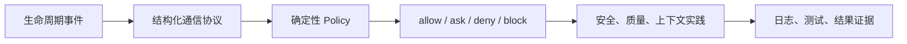
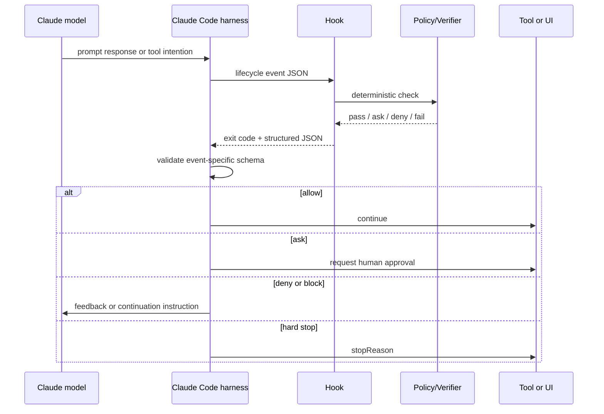
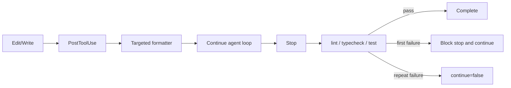

# Claude Code Hooks：从生命周期扩展点到可执行硬约束

- 文档日期：2026-07-13 Asia/Shanghai
- 官方契约核验日期：2026-07-13 Asia/Shanghai
- 本地实验日期：2026-07-12 Asia/Shanghai

本文汇总本次会话关于 Claude Code 与 Codex hook lifecycle、Claude Code `hookSpecificOutput` 协议，以及安全、代码质量、子智能体上下文三个工程实践的结论，并深入论证：

> Hooks 的核心价值不是“多一个自动化脚本入口”，而是夯实 agent 的执行底座，把依赖模型记忆与自觉的关键检查，提升为生命周期中必经、可阻断、可审计的执行约束。

这个结论需要一个重要限定：hook 可以形成 **harness 内硬约束**，但不天然等于 OS security boundary 或组织级不可绕过控制。真正的系统级硬约束通常需要 hooks 与 permissions、sandbox、tool allowlist、CI 和 branch protection 组合。

## 会话成果总览

本次会话形成三层产物：

1. [Claude Code 与 Codex 的 Hook 事件生命周期对比](./claude-code-codex-hook-lifecycle.md)：比较事件覆盖、控制能力和 handler 差异。
2. [Claude Code Hook 输出协议](./claude-code-hook-output-protocol.md)：解释 exit code、stdout/stderr、顶层 decision 与 `hookSpecificOutput`。
3. [Claude Code Hooks 工程实战](../experiments/2026-07-12-claude-code-hooks-engineering/README.md)：实现安全防护、代码质量自动化、子智能体精确上下文管理，并提供 fixtures、tests 和原始结果。



## 一、生命周期：把控制放到正确时间点

截至 2026-07-13，Claude Code 官方 hooks reference 公开 30 个 lifecycle events；Codex 官方 hooks 页面公开 10 个事件，并且这 10 个都能在 Claude Code 找到同名事件。事件数量只表示 hook surface 宽度，不直接等同于产品总体能力或可靠性。

本次工程实践最关键的事件是：

| 时间点 | Hook | 可建立的约束 |
| --- | --- | --- |
| Prompt 进入模型前 | `UserPromptSubmit` | secret scanning、prompt policy、动态 context |
| Tool 副作用前 | `PreToolUse` | deny/ask、rewrite input、保护路径和命令 |
| Permission UI 前后 | `PermissionRequest`、`PermissionDenied` | approval automation、拒绝原因、retry policy |
| Tool 成功后 | `PostToolUse` | formatter、结果修正、增量 feedback |
| Parallel tools 完成后 | `PostToolBatch` | 批次级一致性检查 |
| Agent 宣布完成前 | `Stop` | test/lint/typecheck、Definition of Done |
| Subagent 启动/停止 | `SubagentStart`、`SubagentStop` | 精确 context、输出契约 |
| Context compaction 前后 | `PreCompact`、`PostCompact` | 状态保存、恢复动态 context |

时间点决定控制上限：

- `PreToolUse` 在副作用前运行，适合预防、拒绝和改写。
- `PostToolUse` 在副作用后运行，只能修正后续认知或执行补救，不能撤销已经发生的文件、命令或网络副作用。
- `Stop` 不阻止编辑过程，但能阻止 agent 在验证未通过时把任务宣布为完成。
- `SubagentStart` 适合注入只属于某类 agent 的最小契约，避免污染主 context。

这意味着 hook 设计的第一原则不是“我要运行哪个脚本”，而是：

> 这个 invariant 最晚必须在哪个生命周期节点之前成立？

## 二、协议：Hook 不是直接与模型对话

`hookSpecificOutput` 的正确拼写包含 `t`。它不是发给 Claude model 的 chat message，而是 hook 返回给 Claude Code harness 的事件专用 JSON envelope。

```text
Hook <-> Claude Code harness <-> Claude model / user / tool / permission engine
```



协议有三层：

| 层 | 字段 | 作用 |
| --- | --- | --- |
| 通用控制 | `continue`、`stopReason`、`systemMessage`、`suppressOutput` | 控制整个处理、UI 和日志 |
| 顶层事件决策 | `decision`、`reason` | `Stop`、`PostToolUse` 等事件的 block/feedback |
| 事件专用输出 | `hookSpecificOutput` | `PreToolUse`、`PermissionRequest`、context injection、output rewrite |

典型 `PreToolUse` deny：

```json
{
  "hookSpecificOutput": {
    "hookEventName": "PreToolUse",
    "permissionDecision": "deny",
    "permissionDecisionReason": "Protected path cannot be modified."
  }
}
```

典型 `Stop` gate：

```json
{
  "decision": "block",
  "reason": "Tests are failing. Fix them and run the focused suite again."
}
```

最容易反向理解的是：

- `Stop` 中的 `decision: "block"` 表示阻止停止，因此 Claude 继续工作。
- 通用 `continue: false` 表示终止 Claude Code 后续处理，不是让 Claude 继续。

## 三、为什么关键检查经常停留在软约束

传统 agent workflow 常把检查写进 prompt、`CLAUDE.md` 或任务描述：

```text
修改后请运行测试。
不要改 .env。
完成前检查 lint。
子智能体必须附带证据。
```

这些规则有价值，但主要作用于模型决策层。它们存在四类固有风险：

1. **遗漏**：模型可能因长上下文、任务复杂度或注意力分配而忘记执行。
2. **自我裁量**：模型可能认为检查“不必要”、代价过高，或误判已经完成。
3. **上下文丢失**：compaction、resume、subagent boundary 会改变可见信息。
4. **不可审计**：无法稳定回答“检查是否真的运行、输入是什么、为什么放行”。

Prompt 层规则回答的是：

```text
模型应该做什么？
```

Hook 层规则回答的是：

```text
无论模型是否记得，执行系统在这个时间点必须做什么？
```

这就是从行为建议到执行底座的变化。

## 四、从软提示到硬约束的阶梯

“硬约束”不是非黑即白。可以把 agent control 分为六级：

| 级别 | 机制 | 示例 | 强度 |
| --- | --- | --- | --- |
| L0 | Prompt/文档提示 | “完成前运行测试” | 模型可遗漏 |
| L1 | Observational hook | 记录 tool call、发送通知 | 必经但不控制 |
| L2 | Corrective hook | `PostToolUse` formatter、feedback | 自动修正，但副作用已发生 |
| L3 | Blocking hook | `PreToolUse deny`、`Stop block` | Harness 内硬约束 |
| L4 | Capability boundary | permission deny、sandbox、tool allowlist | 限制实际可执行能力 |
| L5 | External immutable gate | CI required check、branch protection、deployment policy | 独立于单次 agent session |

### 关键结论

Hooks 最有价值的区间是 L2-L3：它把自动化嵌入 agent loop，并能把结果反馈给 Claude 继续修正。但高风险 invariant 不应停在 L3：

- 禁止读取或写入敏感路径：`PreToolUse` + permission deny + sandbox。
- 禁止未通过测试的代码合并：`Stop` + CI required check。
- Subagent 必须只读：context instruction + agent tool allowlist。
- Production deployment 必须人工审批：`PermissionRequest` + 外部 deployment policy。

因此：

```text
Hook hardening != complete security boundary
```

更准确的是：

```text
System hard constraint
  = lifecycle gate
  + deterministic verifier
  + fail-closed decision
  + capability backstop
  + external evidence
```

这是一个工程判断模型，不是数学公式。

## 五、什么条件下 Hook 才算硬约束

一个关键检查要从“自动化”升级成“硬约束”，至少要满足以下条件。

### 1. 覆盖完整

所有能造成目标副作用的路径都必须经过控制点。

反例：只拦截 `Write` tool，但 Bash、Python subprocess 或 MCP tool 仍可写同一文件。此时 hook 只是局部 guardrail。

### 2. 时间点正确

- 要预防副作用，必须在 `PreToolUse` 或更底层 capability boundary 阻断。
- 要保证完成质量，可以在 `Stop` 阻断。
- `PostToolUse` 只能补救，不能声称预防成功。

### 3. Verifier 确定性

安全 deny、路径检查、test exit code 等硬规则应优先使用 deterministic command hook。Prompt/agent hook 适合需要语义判断的 reviewer，但其输出具有模型不确定性，更适合作为 advisory 或第二意见。

### 4. 失败语义明确

需要显式定义：

- Policy 文件缺失怎么办？
- Handler exception 怎么办？
- Timeout 怎么办？
- Invalid JSON 怎么办？
- 外部 policy service 不可用怎么办？

关键 gate 默认 fail open，就不能称为硬约束。本次安全和质量示例在配置或运行错误时使用 `continue: false` fail closed。

### 5. 无静默旁路

Hook matcher、tool aliases、MCP naming、compound shell command 和 subprocess 都可能形成旁路。必须用 permission/sandbox/tool allowlist 补齐 hook 不覆盖的路径。

Claude Code 官方文档在 2026-07-13 明确说明，hook 的 `if` filter 是 best-effort，应使用 permission system 实施 hard allow/deny。这正是 hook 与 capability boundary 需要分层的原因。

### 6. 重入有界

`Stop` 和 `SubagentStop` 可以要求 agent 继续，但若 verifier 永远失败，会形成无限 continuation loop。

本次示例策略：

1. 第一次失败：`decision: "block"`，要求修复。
2. `stop_hook_active: true` 后仍失败：`continue: false + stopReason`，hard stop 并交给用户处理。

### 7. 可审计、可测试

必须能回答：

- 哪个 event 触发了哪个 policy？
- 输入属于哪个 tool/agent type？
- 返回了 allow、ask、deny、block 中的哪一个？
- Verifier 命令、exit code、duration 和结果是什么？
- 是否发生 timeout、schema error 或 bypass？

Policy 与 handler 应通过脱敏 fixture 做独立单测，而不是等真实 agent task 触发后再调试。

## 六、三类工程实践

### 1. 安全防护体系

本次实验使用 [security_guard.py](../experiments/2026-07-12-claude-code-hooks-engineering/hooks/security_guard.py) 和 [security-policy.json](../experiments/2026-07-12-claude-code-hooks-engineering/policies/security-policy.json)：

| 控制 | 事件 | 决策 |
| --- | --- | --- |
| 已知 secret pattern | `UserPromptSubmit` | 顶层 `decision: "block"` |
| `.env`、`.git/**`、credentials、secrets path | `PreToolUse` | `permissionDecision: "deny"` |
| Destructive shell command | `PreToolUse` | `deny` |
| Force push、infrastructure mutation | `PreToolUse` | `ask` |
| State-changing MCP tool name | `PreToolUse` | `ask` |
| Policy/handler error | 所有安全入口 | `continue: false` |

观察：

- 这能把“请不要做危险操作”变为 harness 内可执行决策。
- Regex 仍不是完整 shell parser，secret pattern 也不是 DLP。

建议：

- 绝对禁止项同时进入 permission deny 与 sandbox。
- 中风险项先 `ask`，基于误报和审批数据再升级为 deny/allow。
- 安全日志只记录 rule id 和 decision，不记录 secret 或完整 prompt。

### 2. 代码质量自动化

本次实验使用 [quality_automation.py](../experiments/2026-07-12-claude-code-hooks-engineering/hooks/quality_automation.py)：



这个分层解决两个常见问题：

- 每次编辑跑全量测试太慢，因此 `PostToolUse` 只做局部、确定性的格式化。
- 只在 prompt 里要求测试可能遗漏，因此 `Stop` 必经 repository checks。

要把质量检查真正升级为合并硬约束，还应在外部 CI 重复同一 invariant。Session 内 Stop gate 缩短反馈回路，CI gate 提供独立最终裁决。

### 3. 子智能体精确上下文管理

截至 2026-07-13，Claude Code 官方文档说明 subagent 有独立 context window，并可配置 system prompt、tools、permissions、hooks、skills 等；Explore 和 Plan 为保持轻量会跳过 `CLAUDE.md` 和 parent git status。

本次实验使用 [subagent_context.py](../experiments/2026-07-12-claude-code-hooks-engineering/hooks/subagent_context.py) 按 `agent_type` 注入不同契约：

- `Explore`：read-only discovery、路径与行号证据、不返回 raw search logs。
- `Plan`：不编辑、标出 dependency、verification 和 rollback risk。
- `security-reviewer`：聚焦 changed trust boundaries，finding 必须包含 severity/evidence/impact/remediation。
- `default`：限制 scope，压缩返回结果。

精确 context 的关键不是“多给信息”，而是三种约束分离：

| 约束 | 载体 |
| --- | --- |
| 能做什么 | Agent tool allowlist、permissions |
| 应做什么 | Agent body、delegation prompt |
| 本次启动必须知道什么 | `SubagentStart.additionalContext` |
| 返回必须包含什么 | `SubagentStop` output contract |

`SubagentStop` 对 required sections 的校验只能证明 output shape 完整，不能证明 evidence 真实。高风险结果仍需 parent verifier 或独立 reviewer。

## 七、把关键检查升级为硬约束的方法

### Step 1：把愿望改写成 invariant

弱描述：

```text
最好运行测试。
```

Invariant：

```text
Agent 不得在 focused test command 返回非零时完成当前 turn。
```

### Step 2：选择最早可靠事件

| Invariant | 事件 |
| --- | --- |
| 用户提交的 prompt 中，匹配 policy 的 secret 不进入模型 | `UserPromptSubmit` |
| Tool 不得修改 protected path | `PreToolUse` |
| 每个编辑文件必须格式化 | `PostToolUse` |
| 测试未通过不得完成 | `Stop` |
| Subagent 必须返回 evidence | `SubagentStop` |

### Step 3：定义结构化决策

不要让 handler 只打印自然语言。明确使用：

- allow：无输出或合法 allow decision。
- ask：转人工审批。
- deny：阻止副作用。
- block：阻止当前状态转换，例如 Stop。
- hard stop：`continue: false`。

### Step 4：定义 fail-closed 边界

不是所有 hook 都应该 fail closed。通知和 telemetry hook 可以 fail open；安全 deny、质量完成门禁应明确 fail closed 或转人工。

### Step 5：添加 capability backstop

检查“模型能否通过另一条 tool/subprocess 路径绕开 hook”。如果可以，补 permission、sandbox、tool allowlist 或外部 policy。

### Step 6：添加 fixture contract tests

至少覆盖：

- 正常 allow。
- 已知 deny。
- 中风险 ask。
- Invalid/missing policy。
- Timeout。
- 重入。
- 多 hook decision precedence。
- 敏感数据不出现在日志和 reason 中。

### Step 7：渐进式上线

```text
observe -> warn -> ask -> deny/block -> managed enforcement
```

先观察误报、延迟和 failure rate，再把关键规则从 warning 升级到 blocking。

## 八、评测 Hooks 是否真的夯实了底座

不能只统计“hook 是否触发”。需要测量：

| 维度 | 指标 |
| --- | --- |
| Coverage | 目标副作用路径中经过 gate 的比例 |
| Enforcement | 应阻断 case 的阻断率 |
| False positive | 合法操作被 deny/ask 的比例 |
| Bypass resistance | alternate tool/subprocess 是否能绕过 |
| Availability | hook timeout、exception、invalid output rate |
| Latency | 每个 event 的 p50/p95/p99 增量 |
| Loop safety | Stop/SubagentStop continuation 次数和 hard-stop 率 |
| Evidence | decision、exit code、duration、policy version 是否完整 |
| Outcome | 任务成功率、返工率、CI failure rate 是否改善 |

对于安全和质量 gate，还应做 adversarial fixtures：compound command、路径 traversal、symlink、MCP alias、large output、timeout 和 malformed JSON。

## 九、反模式

### 把 Hook 当成 Prompt 的另一种写法

只返回 `additionalContext: "Please remember to test"`，仍然是软约束。关键检查应由 handler 自己执行并返回结构化 decision。

### 在 `PostToolUse` 声称阻止了副作用

Tool 已运行。该阶段只能 format、redact model-visible output、反馈或补救。

### 每个 Edit 都跑全量 suite

这会显著拖慢 agent loop，并诱发用户关闭 hooks。局部检查放 `PostToolUse`，全局 gate 放 `Stop`。

### 安全 Hook 默认 fail open

Policy service timeout 后静默继续，会使最需要约束的异常场景失去控制。

### 用 LLM Hook 实施确定性 deny

需要精确规则的 path、command、exit code 检查优先 command hook。LLM verifier 用于语义 review，而不是代替 capability boundary。

### 给所有 Subagent 注入相同大段上下文

这会失去 subagent 隔离 context 的价值。应按 `agent_type` 路由最小契约，并用 tools/permissions 表达 capability。

### 依赖 transcript 内部格式

官方只把 transcript path 作为便利输入，不承诺内部 schema 稳定。长期 policy 应依赖 event fields 和稳定 artifact。

## 十、本地实验结果

2026-07-12 的 fixture probe 使用 Python 3.14.5 标准库实现，不调用模型：

| 类别 | Cases | 结果 |
| --- | ---: | --- |
| 安全防护 | 5 | 全部通过 |
| 代码质量 | 4 | 全部通过 |
| 子智能体上下文 | 4 | 全部通过 |
| 合计 | 13 | 全部通过，0 failure |

最终复核运行时间为 0.300s。原始输出见 [实验结果](../experiments/2026-07-12-claude-code-hooks-engineering/results.md) 和 [artifact](../experiments/2026-07-12-claude-code-hooks-engineering/artifacts/test-output.txt)。

### 尚未验证

- 本机没有 Claude CLI，因此没有验证真实 event delivery、UI、permission interaction 和 continuation。
- Fixture 只验证 handler input/output，不证明 model outcome 改善。
- 当前 13 个 cases 尚未覆盖 missing policy、timeout、多 hook precedence、symlink 和 compound-command bypass；这些属于下一轮 adversarial probes。
- 尚未测量 latency tail、误报率、bypass resistance 和 context token savings。
- Security regex 是示例 policy，不是完整 DLP 或 shell parser。

## 结论

Hooks 的工程价值可以压缩为三句话：

1. **把检查放进执行路径**：不再依赖模型是否想起，而是在生命周期节点自动触发。
2. **把结果变成状态转换条件**：检查不通过时 deny、ask、block 或 hard stop，而不是只打印提醒。
3. **把行为变成证据**：event、policy、decision、exit code、duration 和结果可测试、可审计、可演进。

但“硬约束”必须分层理解：

> Prompt 负责塑造行为，Hooks 负责执行与反馈，Permissions/Sandbox 负责限制能力，CI/治理系统负责给出独立最终裁决。

当这四层围绕同一 invariant 对齐时，agent harness 才从“会调用工具的聊天界面”升级为可依赖的工程执行底座。

## 官方来源

- Claude Code Hooks reference：https://code.claude.com/docs/en/hooks
- Claude Code Hooks guide：https://code.claude.com/docs/en/hooks-guide
- Claude Code Permissions：https://code.claude.com/docs/en/permissions
- Claude Code Subagents：https://code.claude.com/docs/en/sub-agents
- Codex Hooks：https://developers.openai.com/codex/hooks
