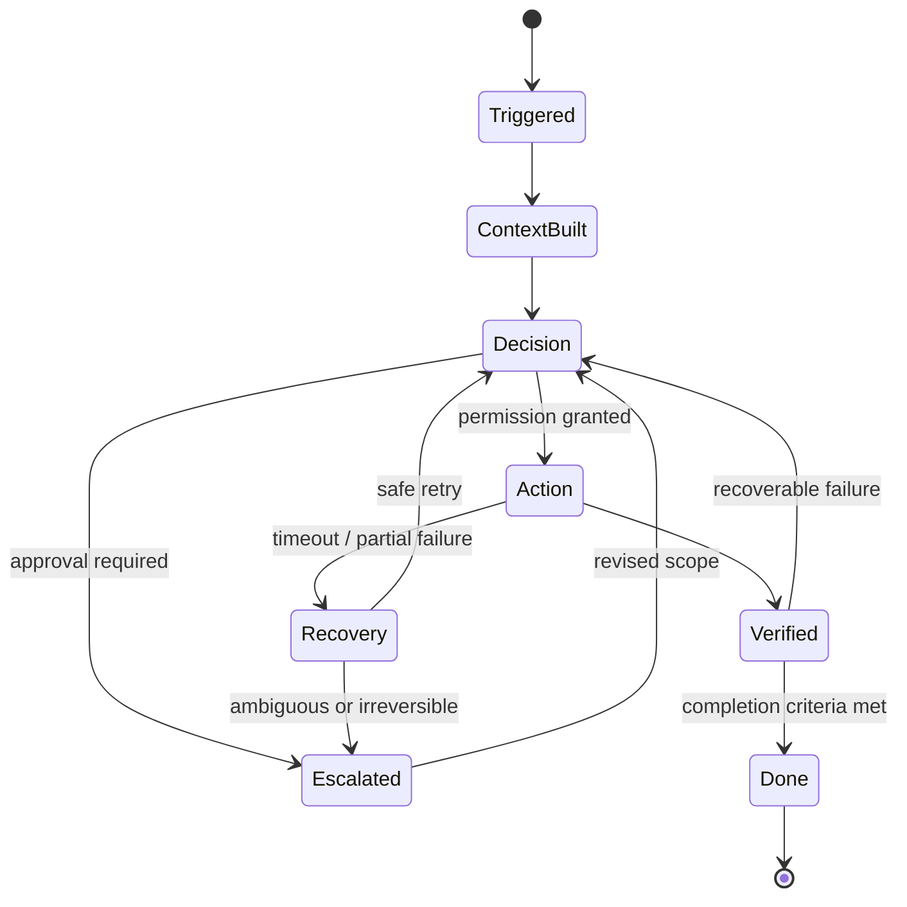
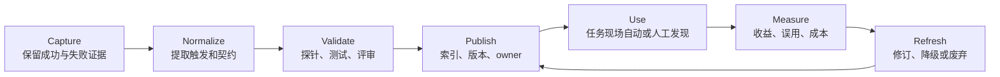

# Harness 工程化思维：机制、层次、约束与公共资产

检查日期：2026-07-15 Asia/Shanghai

本文不是新的工具清单，而是一套用于设计、评审和演进 AI agent Harness 的判断框架。它试图回答四个相互关联的问题：

1. 面对一个 Agent 能力或故障，如何穿过产品名和界面，看到真正起作用的机制？
2. 一项决定应该放在 prompt、Spec、Skill、Plugin、Hook、测试、权限策略还是组织治理中？
3. 如何用恰当的约束降低失败概率，又不把系统锁死？
4. 如何把个人偶然成功的方法，转化为团队可发现、可复用、可验证、可演进的公共资产？

本文是基于本仓库已有研究形成的工程综合建议，不引入新的外部事实。具体产品能力、版本和来源见 [长期演进复杂多服务系统中的 Harness 工程实践](./harness-engineering-practice-for-evolving-multiservice-systems.md) 与 [source map](./source-map.md)。

## 1. 四句话其实是一条工程链

“洞察机制原理、在恰当的层次做出决策、以约束换取可靠性、把个人最佳实践转化为团队公共资产”不是四项独立工作，而是一条闭环：


这条链缺少任何一环都会退化：

- 没有机制理解，规则只是对现象打补丁。
- 层次放错，局部偏好可能污染全局，高风险要求也可能只剩一句软提示。
- 没有执行约束，文档中的决定无法稳定改变行为。
- 没有证据，所谓“最佳实践”只是无法证伪的个人经验。
- 没有资产化和发现机制，团队会反复支付相同的探索成本。

Harness 工程化的核心，不是增加更多 Agent 功能，而是持续缩小“意图、实际行为与可验证结果”之间的距离。

## 2. 洞察机制：从功能名回到因果链

### 2.1 不要在产品概念层推理

“memory”“rules”“agent”“plugin”“auto mode”是产品或交互概念，不是足以支持工程决策的机制描述。同名能力可能有完全不同的作用域、刷新时机、权限边界和失败语义。

分析任何 Harness 能力时，至少拆成下面八个问题：

| 机制要素 | 要回答的问题 | 常见盲点 |
| --- | --- | --- |
| 触发 | 谁在什么事件、阶段或条件下启动它？ | 以为每次都会加载，实际只在特定事件触发。 |
| 输入与上下文 | 它能看到哪些事实，事实何时刷新？ | 把陈旧摘要当作当前状态。 |
| 决策权 | 模型、规则引擎、用户还是外部系统作最终决定？ | 把建议误认为门禁。 |
| 状态 | 状态存在哪里，生命周期多长，能否恢复或重放？ | session 状态与持久事实混在一起。 |
| 能力与副作用 | 它能调用什么工具、修改什么对象？ | 工具 schema 很窄，但底层凭证权限很宽。 |
| 反馈与验证 | 什么信号能证明动作正确？ | 工具调用成功被当作任务成功。 |
| 失败与恢复 | 超时、部分成功、重试和中断如何处理？ | 非幂等动作被静默重试。 |
| 证据 | 哪些输入、决策、动作和结果会被记录？ | 只保留最终文本，无法归因。 |

可以把能力理解为一个乘法链，而不是若干功能的加法：

> 有效能力 = 触发 × 上下文 × 决策权 × 工具 × 状态 × 反馈 × 约束

这不是可直接计算的数学公式，而是诊断启发式：其中任何一项隐式、错误或不可观测，端到端可靠性都会明显下降。给模型更多上下文，不能弥补错误权限；增加重试，也不能弥补错误完成标准。

### 2.2 同时检查认知面、控制面与证据面

一个功能“看起来能工作”通常只说明认知面跑通了。生产可用还需要控制面与证据面：

| 平面 | 核心问题 | 典型 artifact |
| --- | --- | --- |
| 认知面 | Agent 知道什么，如何形成当前判断？ | prompt、检索结果、repo 指令、Spec、上下文摘要。 |
| 控制面 | Agent 被允许做什么，谁批准高风险动作？ | tool schema、sandbox、allow/ask/deny、审批、状态机。 |
| 证据面 | 如何知道它做对了，失败能否复盘？ | trace、diff、测试、contract check、运行指标、审计日志。 |

三者不能相互替代：

- prompt 能让 Agent 知道“不要访问生产”，但不能代替生产凭证隔离。
- sandbox 能阻止越界写入，但不能证明写入 workspace 的业务逻辑正确。
- 测试能发现一部分错误，但不能说明 Agent 当时使用了哪版规则和上下文。

### 2.3 用最小探针确认因果，而不是靠印象调参

机制调查建议使用五步循环：

1. **观察**：保存任务、上下文、工具调用、diff、验证和最终状态。
2. **画链**：写出触发 → 选择 → 动作 → 反馈 → 停止的因果链。
3. **做最小探针**：每次只改变一个变量，例如权限、上下文或 verifier。
4. **分类失败**：区分认知错误、控制错误、状态错误、工具错误、验证遗漏和恢复失败。
5. **编码结论**：把结论放入正确载体，并补验证或回归用例。



调试的对象应当是这条状态转移链，而不只是最后一段自然语言输出。

### 2.4 机制洞察的最低交付物

一次有价值的机制调查，至少应留下：

- 可复现任务和环境版本；
- 期望与实际状态转移；
- 最小失败样例和原始证据；
- 哪个契约被破坏；
- 修复作用在哪个机制要素；
- 如何防止同类回归；
- 仍未被证实的假设。

如果只有“换了一个 prompt 后感觉更好”，它仍是探索笔记，不是工程结论。

## 3. 在恰当层次做决策

### 3.1 一个实用的放置原则

> 在拥有足够信息的最低层做局部决策，在需要一致性的最高层声明公共约束，在能够机械执行的层落实强制。

这句话包含三个不同问题：

1. **谁最了解现场？** 决定判断应该在哪里形成。
2. **影响范围多大？** 决定事实或规则应该在哪里声明。
3. **风险有多高？** 决定约束应该在哪里执行。

“声明层”和“执行层”经常不是同一层。例如：

- OpenSpec 声明 API 兼容性要求，contract test 和 CI 执行它。
- `AGENTS.md` 声明仓库工作约定，lint、test 或 hook 执行其中可确定化的部分。
- 安全政策声明生产数据访问原则，IAM、sandbox 和审批系统执行它。

应当有一个权威事实源，但可以有多个派生执行点；派生点必须可追溯到权威源，避免规则漂移。

### 3.2 先判断七个属性

放置一项决定前，先评估：

| 属性 | 问题 | 对层次的影响 |
| --- | --- | --- |
| 作用域 | 一次任务、一个变更、一个 repo、多个服务还是整个组织？ | 作用域越大，越需要公共和版本化载体。 |
| 生命周期 | 分钟、一个迭代、长期，还是直到某次迁移结束？ | 短期事实不应进入永久规则。 |
| 变化率 | 它是否频繁随代码、环境或组织变化？ | 高频事实应靠实时查询或生成，不靠静态指令复制。 |
| 判断性质 | 是语义判断还是可确定化检查？ | 语义判断适合评审；确定化条件适合自动执行。 |
| 风险与可逆性 | 错误后果多大，能否快速回滚？ | 高风险、难逆动作需要外部硬边界和审批。 |
| 一致性成本 | 不同人或服务做出不同决定会怎样？ | 不一致成本越高，越应提升到共享契约。 |
| 所有权 | 谁能修改、解释、豁免和废弃它？ | 无 owner 的规则不应成为长期公共约束。 |

### 3.3 决策载体地图

| 决策或知识 | 首选载体 | 不适合承担的职责 |
| --- | --- | --- |
| 一次任务的目标、范围、预算、完成标准 | task contract / prompt | 长期组织政策、权限边界。 |
| 当前变更的行为意图、边界假设、验收条件 | OpenSpec change 或同类 change artifact | 存放密钥、替代测试、描述全部历史。 |
| 已生效的领域行为和跨服务契约 | current Spec + contract tests | 临时实现步骤。 |
| 仓库级持久约定 | `AGENTS.md`、`CLAUDE.md`、repo rules | 动态生产事实、冗长教程、所有团队知识。 |
| 重复出现的、有明确输入输出的工作流 | Skill / command / playbook | 不可审计的高风险授权。 |
| 可跨项目分发的一组能力 | Plugin | 只用一次的项目偏好。 |
| 外部实时数据和受控动作 | MCP server / app / connector | 静态文档的唯一存储。 |
| 生命周期事件上的快速响应 | Hook | 隐藏的核心业务逻辑、复杂语义裁决。 |
| 不可妥协的能力边界 | sandbox、permission、IAM、managed policy | 解释业务意图。 |
| 可计算的不变量 | type check、lint、test、policy-as-code、CI | 依赖主观权衡的架构判断。 |
| 长任务的恢复与分支 | 显式状态机、checkpoint、queue | 仅靠聊天历史保存状态。 |
| 难逆且跨团队的架构选择 | ADR | 频繁变化的操作步骤。 |
| 已验证的故障解法 | solution note / runbook，成熟后转 Skill 或检查 | 未验证猜测。 |
| 服务目录、owner 和依赖关系 | service catalog / CODEOWNERS / ownership manifest | 由 Agent 根据代码临时猜测后直接固化。 |

### 3.4 “正确层次”不等于“尽量上收”

中央化可以换取一致性，也会制造瓶颈和错误的全局统一。长期演进的多服务系统更适合三类决定：

- **局部自治**：实现细节、低风险可逆选择，由最接近代码和运行证据的服务团队决定。
- **共享契约**：API、事件、数据所有权、SLO 和兼容窗口，由相关 owner 共同声明并自动验证。
- **平台边界**：身份、密钥、生产发布、审计和最低安全基线，由平台或治理层强制。

只有“不一致造成的系统成本”高于“统一造成的协调成本”时，才值得把决定上收。

### 3.5 常见的层次错配

- 把生产安全边界只写进 prompt。
- 把个人格式偏好升级成组织级 deny policy。
- 把实时 incident 状态复制进长期 repo 指令。
- 让 Hook 用字符串匹配裁决复杂业务语义。
- 为一次性任务提前制造 Plugin。
- 把业务不变量只写在文档中，没有 contract test。
- 把所有服务的细节塞进根目录 `AGENTS.md`，导致上下文膨胀和 owner 模糊。
- 让 Agent 在没有事实源的情况下，把“边界假设”直接写成正式架构。

## 4. 以约束换取可靠性

### 4.1 可靠性来自缩小错误状态空间

Agent 的自由度同时带来适应性和不确定性。约束的价值不是“让模型听话”，而是把可到达的动作和状态限制在团队能够观察、验证和恢复的范围内。

可以用下面的启发式检查设计：

> 可靠性倾向 ∝（边界清晰度 × 独立验证 × 可恢复性 × 可观测性）÷（隐式状态 × 无关自由度）

这同样不是数值模型。它提醒我们：增加指令数量不必然提高可靠性；减少隐式状态、缩小权限和增加独立 verifier 往往更直接。

### 4.2 约束有不同强度


不应把所有规则直接推到最强约束。建议按证据和风险晋升：

- 仍在学习的问题先使用指导和可观测性。
- 已有稳定默认值但允许例外的，使用模板或生成器。
- 可确定化且错误成本有限的，使用自动反馈、警告或自动修复。
- 高风险但存在合法场景的，要求显式批准。
- 无合法业务理由的危险动作，在 Harness 内直接阻断。
- 涉及生产完整性、合规或跨团队契约的关键不变量，在 Agent 外部再次执行。

### 4.3 约束应该覆盖完整生命周期

| 约束面 | 例子 | 主要降低的风险 |
| --- | --- | --- |
| 输入 | 结构化 task schema、必填完成标准 | 目标歧义和漏项。 |
| 上下文 | 目录作用域、检索白名单、freshness 标记 | 污染、过期事实和 token 浪费。 |
| 工具 | 窄 schema、参数校验、幂等 key | 误调用和放大副作用。 |
| 权限 | 最小文件、网络、凭证和环境访问 | 越权与供应链风险。 |
| 预算 | token、时间、重试、并发、外部调用上限 | 无限循环和成本失控。 |
| 状态 | 合法状态转移、checkpoint、lease | 重复执行和恢复混乱。 |
| 输出 | patch 范围、schema、artifact manifest | 隐藏变更和交付不完整。 |
| 验证 | 测试、contract check、独立 reviewer | 把自信误当正确。 |
| 发布 | canary、审批、回滚条件 | 缩小故障半径。 |
| 证据 | trace、版本、输入摘要、决策原因 | 无法审计和归因。 |

只限制“模型输出格式”而不限制工具、状态和发布路径，通常只是表面约束。

### 4.4 按风险分区授权

| 风险区 | 典型动作 | 建议默认 |
| --- | --- | --- |
| 探索区 | 搜索、读取、静态分析、生成计划 | read-only；允许较高自治。 |
| 实现区 | 修改 workspace、运行本地测试 | workspace 隔离、变更范围和预算限制。 |
| 集成区 | 创建 PR、修改共享环境、写 issue | 明确 artifact、owner 和审批；保留完整证据。 |
| 发布区 | 部署、迁移、生产写入、权限变更 | 外部 gate、最小临时凭证、canary 和回滚。 |

自治程度应随“影响半径 × 不可逆性 × 证据缺口”下降，而不是由 Agent 看起来多聪明决定。

### 4.5 好约束的七个特征

一项长期约束应当：

1. 对应已经识别的风险或高价值一致性要求；
2. 作用域最小，不顺带冻结无关选择；
3. 能由其所在层真实执行，而不只是表达愿望；
4. 触发和结果可观察，误拦截可统计；
5. 失败语义明确，知道是阻断、降级还是请求人工；
6. 有 owner、版本、例外路径和废弃条件；
7. 有正反样例或测试，能防止约束本身回归。

### 4.6 约束也有成本，需要预算

过度约束会带来新的系统性风险：合法工作被阻断、成员绕过控制面、规则互相冲突、旧政策冻结新架构，以及大量上下文被低价值条款占用。

因此每项约束都应回答：

- 它避免了哪种已知失败？证据是什么？
- false positive 和 false negative 的成本分别是什么？
- 是否存在更低层、更窄、更确定的执行方式？
- 团队如何临时豁免，谁批准，何时回收？
- 什么事件会触发复核或删除？

可靠性不是“约束越多越好”，而是让每单位约束复杂度覆盖尽可能大的真实风险。

## 5. 把个人最佳实践转化为团队公共资产

### 5.1 最佳实践不是资产

个人习惯只有同时满足以下条件，才开始成为团队资产：

- **可发现**：需要它的人能够在任务现场找到。
- **可理解**：说明适用场景、前置条件和不适用范围。
- **可执行**：有步骤、模板、命令或工具契约。
- **可验证**：有成功标准、样例、测试或评测。
- **可治理**：有 owner、版本、权限、更新和废弃机制。
- **可度量**：能看到使用率、收益、误用和维护成本。

一段只存在于个人 prompt 库、聊天记录或口头传承中的经验，不是公共资产；把它原样复制到 wiki，也只完成了“可见化”的第一步。

### 5.2 晋升不是复制，而是转换

经验资产化需要把隐含判断转换成契约：

| 个人经验中的隐含部分 | 公共资产中的显式表达 |
| --- | --- |
| “遇到类似情况我会这样做” | 明确 trigger 和适用范围。 |
| “我知道该看哪些文件” | 输入、上下文选择和依赖。 |
| “做完大概检查一下” | 输出 schema、完成标准和 verifier。 |
| “有问题再找我” | owner、升级路径和失败语义。 |
| “这个命令在我机器能用” | 环境、版本、准备命令和可复现实验。 |
| “一直这样做就行” | freshness、复核日期和废弃条件。 |

### 5.3 资产晋升阶梯


并非每条经验都应该走到终点：

- 低频、低风险、情境性强的经验，停留在可检索 solution note 即可。
- 重复且步骤稳定的流程，适合 Skill、脚本或模板。
- 跨 repo 需要一致分发和版本管理的能力，才适合 Plugin。
- 已成为系统行为事实的内容，进入 Spec。
- 可确定化的不变量，进入 test、lint、CI 或 policy-as-code。
- 仍需主观权衡的问题，保留为 review rubric，不要伪装成确定性门禁。

### 5.4 五类公共资产

| 类型 | 目的 | 例子 |
| --- | --- | --- |
| 知识资产 | 解释系统和已知事实 | 架构图、service catalog、solution note、故障模式。 |
| 决策资产 | 保留为何这样选择 | OpenSpec change、ADR、边界假设、风险接受记录。 |
| 流程资产 | 让重复工作有稳定路径 | runbook、Skill、模板、checklist。 |
| 可执行资产 | 自动完成或验证工作 | script、Hook、MCP tool、test、Plugin。 |
| 治理与度量资产 | 控制风险并反馈效果 | permission policy、eval、trace schema、dashboard。 |

不要用一种载体承载所有资产。尤其不要让根目录指令文件同时承担教程、架构史、操作手册、权限策略和动态状态。

### 5.5 资产晋升门槛

一项个人实践进入团队默认路径前，建议完成以下检查：

1. **有证据**：在多个任务或多位成员中重复出现；高严重度单次事故也可直接触发治理。
2. **可泛化**：明确稳定机制与偶然环境因素，写出不适用范围。
3. **有契约**：输入、输出、副作用、完成标准和失败处理清晰。
4. **有验证**：正例、反例、回归测试或小型 eval 可运行。
5. **有安全审查**：依赖、数据流、凭证和权限边界已检查。
6. **有 owner**：有人负责解释、更新、冲突处理和废弃。
7. **可发现**：出现在 repo 索引、任务入口或检索元数据中，而非孤立存放。
8. **可演进**：有版本、变更记录、兼容策略和复核日期。

### 5.6 公共资产的最小契约

可以为 Skill、runbook、规则或检查器采用统一元数据；字段可按载体调整：

```yaml
id: cross-service-event-change-review
kind: skill
owner: platform-architecture
scope:
  repositories: [orders, billing, analytics]
trigger: "修改 OrderCompleted event schema"
inputs:
  - proposed_delta
  - consumer_inventory
outputs:
  - compatibility_report
side_effects: none
verification:
  - schema_compatibility_test
  - consumer_contract_test
risk: medium
permissions: read-only
version: 1.3.0
last_reviewed: 2026-07-15
review_on:
  - new_consumer_type
  - compatibility_incident
deprecation: "被 service catalog 的自动 contract gate 替代后删除"
```

元数据的目的不是形式完整，而是让 Harness 能在正确任务中发现资产、判断是否适用，并为使用结果归因。

### 5.7 资产生命周期



公共资产最容易缺失的不是“发布”，而是发现、度量和废弃。找不到的资产等于不存在；无人复核的资产最终会变成上下文污染。

### 5.8 不要只统计资产数量

更有意义的指标包括：

- 相关任务中的发现率和实际复用率；
- 使用资产后的任务通过率、首次通过率和人工干预次数变化；
- 相同失败类型的复发率；
- 规则或 Hook 的误拦截率与绕过率；
- 新成员达到独立交付所需时间；
- 资产 freshness、无 owner 比例和废弃延迟；
- 维护资产消耗的时间、token 和 CI 资源；
- Plugin、Skill 或规则升级后的跨 repo 一致性。

每个指标都应与具体任务类别、模型、工具权限、预算和风险画像绑定，避免把相关性误当因果。

## 6. 四个反馈回路应使用不同节奏

| 回路 | 时间尺度 | 主要决定 | 主要证据 |
| --- | --- | --- | --- |
| 任务回路 | 分钟到小时 | 下一步工具调用、停止、重试或升级人工 | trace、tool result、局部测试。 |
| 变更回路 | 天到周 | 范围、边界假设、契约、实现与评审 | OpenSpec change、diff、CI、review。 |
| 平台回路 | 周到月 | 共享 Skill、Plugin、权限默认值和评测集 | 跨任务统计、安全审查、兼容测试。 |
| 治理回路 | 月到季度 | 组织政策、风险接受、资产废弃和投资优先级 | incident、审计、成本趋势、成熟度评估。 |

变化快的事实不应复制进变化慢的层。生产 incident 当前状态属于实时数据源，不属于季度政策；组织安全基线也不应由一次任务 prompt 临时改写。

## 7. 在边界未清的多服务系统中应用

边界没有划清时，最大的错误是把不确定性隐藏起来。Harness 应把“事实、假设、决定和证据”分开：

| 对象 | 初始载体 | 如何验证 | 稳定后的去向 |
| --- | --- | --- | --- |
| 观察到的调用、数据流和 owner | evidence note / service inventory | 代码搜索、trace、部署与团队确认 | service catalog / 架构视图。 |
| 对服务职责的猜测 | change 中的 boundary hypothesis | consumer 影响分析、演练、评审 | ADR、领域说明或删除。 |
| 本次变更的行为 | delta Spec | contract test、端到端探针 | archive 后成为 current Spec。 |
| 跨服务不变量 | 共享契约 | provider/consumer contract CI | 版本化 Spec + 自动 gate。 |
| 暂时迁移路径 | migration plan / runbook | checkpoint、canary、回滚演练 | 完成后归档，不进入永久规则。 |
| 重复故障处理 | solution note | 多次 incident 验证 | runbook / Skill / 自动检测。 |

### 示例：修改跨服务事件字段

假设要修改 `OrderCompleted` event，但 producer、consumer 和数据 owner 尚未完整登记：

1. **机制层**：先枚举实际 producer、broker、schema registry、consumer、重放语义和 dead-letter 处理，保留证据来源与时间。
2. **决策层**：把未知 consumer 和 owner 记录为 boundary hypothesis；把兼容窗口与验收条件写入 change Spec；只有稳定的长期取舍才写 ADR。
3. **约束层**：探索阶段只读；实现阶段限制可改 repo；集成阶段运行 schema 与 consumer contract test；发布阶段使用 canary、checkpoint 和外部审批。
4. **资产层**：第一次调查保留 consumer inventory；重复后提炼为事件变更 Skill；能自动检查后接入 CI；跨 repo 稳定复用后才打包 Plugin。

这样既不会因为边界未知而停止演进，也不会让 Agent 把一次推断直接变成永久架构事实。

## 8. 工程成熟度：从个人技巧到组织能力

| 等级 | 行为特征 | 主要风险 | 晋升证据 |
| --- | --- | --- | --- |
| E0 个人技巧 | prompt 片段、手工检查、经验依赖个人 | 不可发现、不可复现 | 保存任务、diff 和验证结果。 |
| E1 可见实践 | repo 文档、checklist、solution note | 容易过期，执行不一致 | 多人复用记录、owner、复核日期。 |
| E2 可执行实践 | Skill、script、模板、确定性 verifier | 权限和版本仍可能分散 | 回归测试、任务级 eval、失败归因。 |
| E3 团队能力 | 共享 Plugin、统一 catalog、managed defaults | 中央化耦合、升级半径变大 | 跨 repo 兼容、安全审查、灰度升级。 |
| E4 组织系统 | 分级自治、资产生命周期、持续度量与治理 | 指标异化、治理成本 | 风险调整后的收益、废弃机制、审计闭环。 |

成熟度不是安装了多少 Plugin，而是团队能否把一次运行的证据稳定转化为下一次运行的更好默认值，同时控制新默认值自身的风险。

## 9. 一套可直接使用的决策算法

遇到新的规则、经验、工具或故障时，依次回答：

1. 它是事实、假设、决定、流程、能力、约束还是证据？
2. 它影响一次任务、一个变更、一个 repo、多个服务还是整个组织？
3. 它的有效期和变化率是什么？
4. 判断能否确定化？false positive 与 false negative 哪个更贵？
5. 动作有什么副作用，影响半径和可逆性如何？
6. 谁拥有修改、批准例外和废弃的权力？
7. 哪个层次有足够信息作出决定？
8. 哪个层次能够真正执行，而不只是声明？
9. 用什么独立证据证明它有效？失败时如何恢复？
10. 何时应该升级为公共资产，何时应保持局部或删除？

可使用下面的简短记录模板：

```markdown
## 决策

- 对象类型：事实 / 假设 / 决定 / 流程 / 能力 / 约束 / 证据
- 作用域与期限：
- 当前证据：
- 声明层：
- 执行层：
- owner：
- 风险与合法例外：
- verifier：
- 失败与回滚：
- 复核或废弃条件：
```

## 10. 需要持续警惕的反模式

### Prompt archaeology

团队靠翻历史对话寻找“当时为什么这样做”。修复方式是把目标、决定和证据分别迁移到 change artifact、ADR 和 trace，而不是保存更多聊天。

### `AGENTS.md` dumping ground

任何经验都被追加到根指令，最终规则冲突、上下文膨胀、无人敢删除。修复方式是按作用域路由，并为持久规则设置 owner 与复核条件。

### Premature pluginization

流程尚未稳定就打包分发，导致偶然实现成为跨 repo 依赖。先使用本地 Skill 或脚本验证契约，再根据真实复用升级。

### Hidden business logic in hooks

Hook 悄悄改变关键业务决定，用户和 Agent 都看不到。Hook 适合生命周期响应和可确定化检查；业务事实应有明确 Spec、代码和测试。

### Policy without evidence

一次不愉快经历直接产生永久 deny。先保存失败类型、影响和复发证据；严重安全事件可以立即止血，但仍要安排复核和收窄。

### Asset without owner or deprecation

发布后无人负责，旧资产与新资产同时被检索。公共资产必须能更新、降级和删除。

### Global rules for local diversity

为了表面统一，把不同服务的运行条件压成同一实现。统一契约和最低边界，把实现自治留在局部。

### Reliability by more reviewers

增加 Agent reviewer 数量却没有独立 verifier、失败分类和停止条件，只会增加成本与意见噪声。

## 11. 十条工程准则

1. 从状态转移和权限边界理解能力，不从产品名猜测能力。
2. 把事实、假设、决定、流程、约束和证据放进不同 artifact。
3. 在拥有足够信息的最低层决定，在需要一致性的最高层声明。
4. 让可确定化的要求由机器执行，让语义权衡保持可见评审。
5. 权限、状态和发布边界不能只靠 prompt。
6. 约束必须对应风险，并有 owner、证据、例外和废弃条件。
7. 自治程度由影响半径、可逆性和证据质量决定。
8. 个人经验先变成可复现实验，再变成团队默认值。
9. 公共资产的价值由发现、复用和效果衡量，不由文件或 Plugin 数量衡量。
10. 每次运行都应留下足够证据，让下一次运行能够获得更好的默认值。

## 12. 与仓库其他文档的关系

- [Harness 原则](./harness-principles.md)：最小定义、核心契约和成熟度基线。
- [Agent Harness 中的软件设计原则](./software-design-principles-in-agent-harnesses.md)：可组合性、关注点分离、依赖倒置、显式状态等设计依据。
- [四层 Harness 架构](./four-layer-harness-architecture.md)：记忆层、扩展层、集成层、编程层及横切控制的职责边界。
- [长期演进复杂多服务系统中的 Harness 工程实践](./harness-engineering-practice-for-evolving-multiservice-systems.md)：成本、调试、安全、规模、指令、协作以及插件组合的具体实践。

本文是这些内容的上位决策框架：它不替代具体工具说明，而是帮助团队判断何时使用哪一种机制、把决定放在哪里，以及如何通过证据把局部经验逐步升级为可靠的公共能力。
