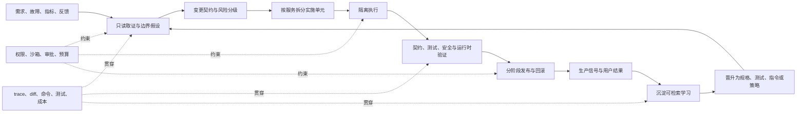
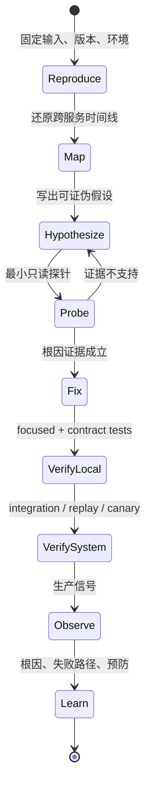
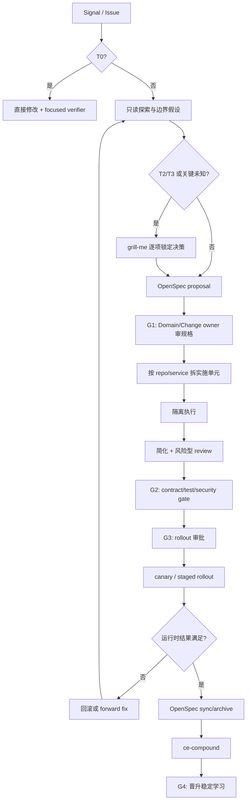

# 长期演进复杂多服务系统中的 Harness 工程实践

检查日期：2026-07-15 Asia/Shanghai

本文从成本、调试、安全、规模、指令、协作六个方面讨论 AI agent Harness 在真实工程中的实践，重点面向以下工作负载：

- 系统由多个服务、仓库、数据存储和异步链路组成。
- 业务边界、数据所有权和团队职责尚未完全划清。
- 需求、实现和组织结构会长期变化，不能依赖一次性“大重构”解决所有问题。
- Agent 可以读写代码、运行测试、访问 issue/PR/监控系统，因而既能放大吞吐，也会放大错误和权限风险。

本文还给出 OpenSpec + Compound Engineering + grill-me 的组合方式，以及截至 2026 年 07 月适合长期演进项目的插件组合建议。

如果需要先判断一项经验为什么有效、决策应该进入 prompt、Spec、Skill、Plugin、Hook、测试还是权限边界，以及何时应晋升为团队默认值，先阅读 [Harness 工程化思维：机制、层次、约束与公共资产](./harness-engineering-mindset.md)。本文在该上位框架下展开具体的多服务工程实践。

## 证据边界

### 已核验观察

外部工具事实均在 2026-07-15 核验：

- OpenSpec 最新 release 为 `v1.6.0`，发布于 2026-07-10；`package.json` 要求 Node.js `>=20.19.0`。它使用 `openspec/specs/` 表示当前行为，使用 `openspec/changes/` 表示拟议变更，并在 archive 时把 delta 合回当前规格。
- OpenSpec Stores、references、working context 和 worksets 仍明确标记为 beta；官方说明命令、flag、文件格式和 JSON 输出可能变化。
- Compound Engineering 最新 release 为 `compound-engineering-v3.19.0`，发布于 2026-07-08，对应提交 `1756c0b9f3cf94493f287ea29ae766ad668fb7cf`。当前主循环是 brainstorm、plan、work、simplify、review、compound；插件 manifest 版本为 `3.19.0`。
- `grill-me` 本文采用 `alirezarezvani/claude-skills` 中的插件发行版 `2.9.0`，仓库快照提交为 `84dc5a4f6ab93df5195805010572d7d0f874dadb`（2026-07-14）。它要求逐个问题、深度优先走完决策树，并在可以从代码库取证时先查代码。
- Anthropic 官方插件目录快照为 `7b8dfeb2d02727ff17b2437c7a00def0cf069972`（2026-07-14）。目录本身明确提醒：进入官方目录不代表 Anthropic 能控制或持续验证第三方插件所包含的 MCP、文件或软件。
- Codex 当前公开插件说明将 plugin 定义为可打包 Skills、Apps、MCP servers、Browser extensions、Hooks 和 scheduled task templates 的分发单元；经 Codex host 执行时仍受 host sandbox 和 approval policy 约束。

### 本文建议

下文关于职责划分、门禁、成本模型、协作方式和推荐组合属于工程综合建议，不是上述项目的官方保证。

本仓库当前没有 Node.js，因此没有安装或运行 OpenSpec、Compound Engineering 和 grill-me 的本地端到端探针。本文不能声称这套组合已经在本仓库证明能降低成本或提高通过率；最后给出了一套应当补做的试点评测。

## 先给结论

长期演进复杂系统中，Harness 最重要的作用不是“让 Agent 更自主”，而是把不确定性变成可管理的工程对象：

1. 用变更契约约束目标，不让需求只活在聊天历史中。
2. 用边界假设描述尚未确认的服务职责，不把猜测伪装成架构事实。
3. 用工具、权限、沙箱和审批控制副作用，不把安全寄托在 prompt 自觉上。
4. 用 trace、测试、diff、部署和运行时证据串起变更生命周期。
5. 用隔离的工作单元扩大吞吐，而不是无上限增加 agent 数量。
6. 把复用经验先沉淀为可检索证据，重复验证后再晋升为持久指令、自动检查或架构契约。

对 OpenSpec + Compound Engineering + grill-me，推荐的职责是：

| 组件 | 唯一主责 | 不应承担 |
| --- | --- | --- |
| grill-me | 质询尚未做出的高影响决策，暴露假设、依赖、替代方案和失败模式。 | 不作为规格、实施计划或最终决策的事实源。 |
| OpenSpec | 保存当前行为、拟议 delta、设计和变更验收契约。 | 不替代运行时观测、权限边界和确定性测试。 |
| Compound Engineering | 研究、执行、简化、审查并沉淀已验证学习。 | 不再复制一套与 OpenSpec 竞争的需求事实源。 |
| Harness runtime | 管理工具、状态、权限、隔离、审批、日志、恢复和预算。 | 不把自然语言说明当作物理安全边界。 |

最重要的组合规则是：同一阶段只允许一个 canonical artifact，任何其他产物只能引用它、补充不同职责的信息，不能全文复制。

## 1. 复杂系统真正模糊的五类边界

“服务边界不清”通常不是一个问题，而是五类问题叠加：

| 边界 | 需要回答的问题 | 可验证证据 |
| --- | --- | --- |
| 业务语义 | 哪个 capability 对某个业务结果负责？同一术语在各服务是否同义？ | 规格、领域词表、用户旅程、业务不变量。 |
| 数据所有权 | 谁可以创建、修改、删除和解释这份数据？谁是 system of record？ | Schema、写路径、事件、迁移、审计记录。 |
| 运行时依赖 | 一个请求、事件或批任务实际经过哪些组件？失败如何传播？ | Distributed trace、日志、拓扑、故障注入结果。 |
| 变更兼容性 | 哪些 producer/consumer 必须一起变化？允许多长兼容窗口？ | API/event contract、consumer test、版本和 rollout 记录。 |
| 人与团队职责 | 谁批准语义变化、数据迁移、安全例外和发布？ | CODEOWNERS、服务目录、on-call、变更审批记录。 |

不要在第一次分析时强行给出“正确边界”。先创建有证据等级的边界假设：

```yaml
boundary_hypothesis:
  capability: invoice-settlement
  candidate_owner: billing-team
  confidence: medium
  observed_writers:
    - checkout-service
    - billing-worker
  conflicting_evidence:
    - support-console can override settlement_status
  decision_needed: choose the system of record for settlement_status
  owner: staff-engineer-billing
  review_by: 2026-08-15
```

这里的关键不是 YAML，而是显式区分：

- 已观察到的事实。
- 基于事实的推断。
- 尚待做出的决策。
- 决策所有人和复核日期。

## 2. Harness 在多服务系统中的控制面

Harness 不应成为新的业务服务，也不应把所有代码库吞进一个超级上下文。它更适合充当变更控制面：



### 建议的 artifact 分工

| 信息 | Canonical artifact | 生命周期 |
| --- | --- | --- |
| 系统当前应有行为 | `openspec/specs/` | 持续维护。 |
| 一次变更的 why/what/delta | `openspec/changes/<change-id>/` | 提议到 archive。 |
| 重大不可逆架构决策 | ADR | 长期，允许 supersede。 |
| 领域术语 | `CONCEPTS.md` 或领域词表 | 长期，需 owner。 |
| 执行状态 | Harness task state、commit、PR、CI | 运行期，不写回静态 plan checkbox 充当事实。 |
| 已验证问题解决经验 | `docs/solutions/` | 可检索，定期去重和刷新。 |
| 稳定 repo 规则 | `AGENTS.md` / `CLAUDE.md` / path-scoped rules | 长期、小而稳定。 |
| 机械强制规则 | test、linter、policy、sandbox、hook、CI | 版本化执行。 |
| 运行时事实 | traces、metrics、logs、deployment records | 有保留期和脱敏策略。 |

## 3. 六个方面的工程实践

### 3.1 成本：优化被接受的变更，而不是单次 token

#### 成本模型

复杂项目的总成本至少包含：

```text
变更总成本
= 模型 token / API 成本
+ 工具和执行环境成本
+ 人工澄清、审批和审查时间
+ 重试、冲突和重复规划成本
+ 错误实现的返工成本
+ 缺陷逃逸和延期成本
```

因此，单纯减少 token 可能增加总成本。边界模糊时，适量的前置探索和规格审查通常是在用便宜的文本修改替代昂贵的跨服务返工；但这仍需在具体任务上测量，不能成为无限规划的理由。

#### 实践

1. **为一次变更设总预算，而不是只设模型预算。**
   记录 token、墙钟、tool CPU 分钟、并行 worker 数、人工分钟、重试和废弃产物。
2. **按风险分配流程。**
   trivial change 不经过完整 grill/spec/multi-agent review；跨服务 contract、迁移、权限和资金路径才启用完整门禁。
3. **先做 context routing。**
   先读服务目录、调用链、相关规格和最近变更，再按需展开文件；避免把所有 repo、所有 solution note 和所有 plugin instruction 一次性加载。
4. **限制 fan-out。**
   并行 agent 默认以依赖层为单位，通常控制在 3–5 个有独立输入和验收的 worker；共享 schema、migration、lockfile、端口或数据库的单元串行执行。
5. **停止重复规划。**
   grill-me 已锁定的决策写入 OpenSpec 后，不再由 `ce-brainstorm` 重问；OpenSpec 已有 design/tasks 时，不再生成一份全文重复的 CE plan。
6. **把“compound”当作投资预算。**
   只沉淀非平凡、已验证、可复用的学习；每个小修都生成长文会形成检索噪声和维护债。
7. **用确定性工具完成机械工作。**
   搜索、格式化、schema diff、测试选择、依赖图和日志聚合优先交给脚本或已有工具，模型负责歧义和取舍。

#### 指标

| 指标 | 解释 |
| --- | --- |
| `cost_per_accepted_change` | 模型、计算、人工和返工成本 / 被接受变更数。 |
| `cost_per_verified_unit` | 每个通过独立 verifier 的实施单元成本。 |
| `waste_ratio` | 被废弃的 plan、patch、review 和重复运行成本 / 总成本。 |
| `human_intervention_minutes` | 人工用于澄清、审批、冲突处理和返工的时间。 |
| `context_reuse_hit_rate` | 从规格、solution、脚本中命中有效先例的任务比例。 |
| `retry_by_failure_class` | 按需求、上下文、工具、权限、环境、代码、验证错误分类的重试。 |

#### 反模式

- 为了“充分思考”固定启动十几个 reviewer。
- 用更长的全局 instruction 代替按需检索。
- 为 trivial fix 创建完整 OpenSpec change、CE plan 和多 agent review。
- 只报告 token，不报告人工等待、冲突和返工。

### 3.2 调试：建立从变更意图到生产请求的因果链

在多服务系统中，代码栈不是完整因果链。一个故障可能来自旧 producer、新 consumer、重放消息、数据修复脚本、配置漂移或权限变更。

#### 统一关联字段

每个 Harness run 至少记录：

```text
change_id, run_id, attempt, task_id, agent_id
repo, service, commit_sha, branch/worktree
model, harness_version, plugin_versions
tool_name, command, exit_code, duration
environment, deployment_id
trace_id / request_id / message_id（可得时）
verifier, result, artifact_path
```

`change_id` 应贯穿 OpenSpec change、CE 工作流、commit/PR、部署和复盘。生产系统的 `trace_id` 不必直接进入规格，但应能从 deployment/commit 反查到 change。

OpenTelemetry 官方文档在 2026-07-15 说明，context propagation 用于跨进程和服务关联 traces、metrics 与 logs；Baggage 会随请求传播，可能泄露敏感信息且没有内建完整性保证。因此不要把 secret、PII 或可被信任为授权依据的字段放入 Baggage。

#### 调试循环



#### 实践

1. **先复现再修复。**记录输入、版本、环境、时间窗口和预期/实际行为。
2. **维护 hypothesis ledger。**每个假设包含支持证据、反证、下一探针和状态；不要让聊天推理成为唯一记录。
3. **先读运行时链路，再猜服务边界。**静态 import graph 不能代表动态流量、feature flag、消息重放和数据修复路径。
4. **把工具调用作为 span 看待。**记录输入摘要、输出摘要、错误、重试、审批、成本和父任务。
5. **区分可重放与可审计。**外部 API、时间、队列和生产数据常使完全重放不可能；至少保存输入 hash、版本、采样数据、mock/fixture 和不可重放原因。
6. **让 verifier 独立。**生成 patch 的 agent 不应只靠自评宣布成功；由测试、contract checker、静态分析、运行时探针或独立 reviewer 提供证据。
7. **失败归因到层。**至少区分 specification、context、model judgment、tool、permission、environment、implementation、verification 和 rollout。

#### 指标

- Mean Time to Reproduce。
- Mean Time to Root Cause。
- 有完整 `change_id -> commit -> deploy -> trace` 链路的事件比例。
- 可由原始 evidence bundle 复核的失败比例。
- “无法归因”失败比例。
- 同类根因重复发生率。

### 3.3 安全：自然语言管意图，运行时管能力

#### 四层防线

| 层 | 机制 | 适合做什么 |
| --- | --- | --- |
| 指令层 | `AGENTS.md`、`CLAUDE.md`、Skill、plan | 说明允许的目标、流程和停止条件。 |
| 授权层 | tool allow/ask/deny、MCP scopes、service account | 决定某类动作是否可请求或执行。 |
| 隔离层 | sandbox、container、VM、worktree、network policy | 限制进程实际可读写和可连接范围。 |
| 治理层 | hooks、CI、branch protection、deploy gate、audit log | 强制检查、审批、追责和回滚。 |

#### 风险面

- 外部 issue、网页、日志、PR comment 和 MCP resource 中的 prompt injection。
- 插件安装脚本、hook、MCP server、transitive dependency 的供应链风险。
- Agent 读取过量生产数据、secret、PII 或客户内容。
- 写 issue、合 PR、修改云资源、迁移数据、发布和通知等真实副作用。
- 多 agent 继承或扩大主 agent 权限。
- trace、memory 和 solution doc 长期保留敏感信息。

#### 实践

1. **默认 read-only，按动作升权。**发现和规划阶段不需要写生产系统；代码写入、外部写入、部署和数据变更使用不同审批级别。
2. **外部内容一律按不可信数据处理。**不要把网页、issue、日志和 MCP 返回文本直接拼成高优先级指令。
3. **对插件做 capability review。**检查 Skill、hook、MCP、monitor、安装脚本、网络、凭证、外部写动作和更新机制。
4. **冻结可复核版本。**团队基线记录 release 或 commit SHA；先在隔离 profile/canary repo 更新，再推广。
5. **关键 gate fail closed。**secret、受保护路径、生产 deploy、不可逆 migration 的控制故障应阻断或转人工；通知和 telemetry 可以 fail open。
6. **把测试数据和生产数据分开。**调试插件优先使用脱敏样本、最小时间窗和字段 allowlist。
7. **不要把 hook 当作唯一边界。**matcher、alias、组合命令、MCP 和非 shell 工具可能形成未覆盖路径；最终仍依赖 sandbox、permissions 和外部系统 ACL。
8. **安全审查也需要 evidence。**finding 应包含 source、sink、攻击前提、影响、不变量、复现和验证命令；模型猜测只标为 hypothesis。

#### 插件准入清单

```yaml
plugin_lock:
  name: compound-engineering
  source: https://github.com/EveryInc/compound-engineering-plugin
  version: 3.19.0
  commit: 1756c0b9f3cf94493f287ea29ae766ad668fb7cf
  reviewed_components:
    skills: true
    hooks: true
    mcp: true
    install_scripts: true
  permissions:
    filesystem: workspace-write
    network: deny-by-default
    external_writes: approval-required
  owner: developer-platform
  reviewed_on: 2026-07-15
  review_after: 2026-08-15
  rollback: reinstall-previous-lock
```

字段值必须来自实际包检查；上例是治理结构示意，不是对 Compound Engineering 权限面的审计结果。

### 3.4 规模：扩大可隔离工作单元，不扩大共享混乱

“规模”至少有五种：代码规模、服务/仓库数量、任务并发、团队人数和运行时间。多 agent 只直接解决其中一部分并发问题。

#### 扩展原则

1. **以依赖图调度，不以文件数调度。**共享 API、schema、migration、generated client、lockfile、测试环境和端口都构成隐式依赖。
2. **隔离写入。**每个并发实施单元使用独立 worktree/branch，必要时使用独立 container、数据库 schema、queue namespace 和端口范围。
3. **限制并发并提供 backpressure。**当 review queue、CI、MCP rate limit 或集成环境饱和时停止派生新 worker。
4. **主 Agent 保留合并责任。**worker 返回变更路径、证据、未知项和冲突；主 Agent 检查真实 diff、按依赖顺序集成并运行权威验证。
5. **把长任务拆成 checkpoint。**每个 checkpoint 有输入版本、完成标准、artifact 和 resume 信息；context compaction 后不依赖模型“记得”。
6. **跨 repo 先拆 contract，再拆代码。**一个跨服务 change 可以有一个共同意图，但实施、测试和发布应是各 repo 可独立验收的单元。
7. **渐进扩大自治。**先在单服务、可回滚、确定性测试充分的任务证明 H2，再增加外部写入、跨 repo 和自动发布。

#### 并行安全矩阵

| 情况 | 建议 |
| --- | --- |
| 文件、contract、环境都独立 | 可并行。 |
| 文件独立但共享 schema/API | 先确定 contract，再按 consumer/provider 顺序或兼容窗口执行。 |
| 共享数据库 migration | 串行设计；expand/contract 分阶段发布。 |
| 独立代码但共用单实例测试环境 | 分配命名空间或串行。 |
| 多 worker 修改同一文件 | 默认串行；隔离分支只让冲突可恢复，不让语义自动兼容。 |
| 无独立 verifier | 不因可并行而并行，先补验证。 |

#### 指标

- Critical path wall-clock，而不是所有 agent 总运行时间。
- 并行批次冲突率和重跑率。
- 每个 worker 的有效产出 / token。
- 集成等待时间、CI queue time、environment contention。
- 中断后可从 checkpoint 恢复的任务比例。
- orphan worktree、进程、临时凭证和未清理资源数量。

### 3.5 指令：把作用域、优先级和验证写清楚

#### 推荐层级

```text
组织 managed policy / 安全底线
  -> repo 根 AGENTS.md / CLAUDE.md
    -> service 或目录级 scoped instructions
      -> OpenSpec change / 当前 task contract
        -> 按需 Skill / plugin workflow
          -> 当前工具结果和用户纠正
```

不同层解决不同变化频率：

| 层 | 放什么 | 不放什么 |
| --- | --- | --- |
| 组织策略 | 合规、数据、禁止行为、审批底线。 | 项目命令和个人偏好。 |
| Repo 指令 | 结构、构建测试命令、架构约束、完成证据。 | 长篇领域百科、临时任务。 |
| 目录指令 | 某服务/模块的约束、owner、测试。 | 对其他目录无关的规则。 |
| Change contract | 本次目标、非目标、delta、风险、验收。 | 永久团队规则。 |
| Skill | 重复工作流、路由、脚本和参考。 | 每次自动加载的全部知识。 |
| Hook/policy | 可机械判断的阻断或审批。 | 需要开放语义判断的长篇建议。 |

#### 高质量指令的写法

- 写触发条件和不触发条件。
- 写允许、禁止和必须请求确认的动作。
- 写可执行的构建/测试命令和最小验证集。
- 写“无法验证时如何报告”，不要要求 Agent 填补未知事实。
- 写证据格式：路径、命令、exit code、diff、测试和未确认项。
- 写冲突优先级和 owner。
- 对当前工具事实写核验日期和版本；易过期内容放 source map 或 reference，不塞进永久 root instruction。
- 用 nested instructions 控制局部规则，避免根文件增长为数千行。

#### 边界模糊时的默认指令

```text
不要把目录名、类名或当前调用关系直接当作服务所有权证据。
先列出观察、推断和未决问题。
涉及跨服务行为、数据写入、public contract、migration 或权限时，
必须标出 owner、兼容策略、rollout、rollback 和独立 verifier。
无法确认业务不变量时停止实施并请求对应 domain owner 决策。
```

#### 指标

- instruction violation 和用户重复纠正次数。
- 根指令 token 大小及增长率。
- scoped rule 命中准确率。
- 因冲突或过期指令造成的失败数。
- 稳定规则被自动 verifier 覆盖的比例。

### 3.6 协作：Agent 可以执行和质疑，但不能成为责任主体

#### 人与 Agent 的责任划分

| 角色 | 主要责任 |
| --- | --- |
| Change owner（人） | 定义结果、预算、风险等级和最终接受。 |
| Domain owner（人） | 决定业务语义、数据所有权和非功能不变量。 |
| Security/Data/Operations owner（人） | 批准高风险例外、迁移、生产访问和 rollout。 |
| Orchestrator agent | 拆分任务、选择上下文、控制并发、合并证据。 |
| Explorer agent | 只读定位代码、contract、历史和运行时证据。 |
| Implementer agent | 在隔离范围内修改并完成局部验证。 |
| Reviewer agent | 按一个明确量规审查，返回可定位 finding。 |
| Deterministic verifier | 给出可重复的 pass/fail 和原始输出。 |

Agent 不能替代业务、合规和生产责任人。即使 Agent 生成了方案，decision record 的 owner 仍应是人或正式团队角色。

#### 委派契约

每次子任务至少包含：

```yaml
goal: 要交付的局部结果
boundary:
  in_scope: []
  out_of_scope: []
inputs:
  files: []
  spec_ids: []
  evidence: []
permissions:
  filesystem: read-only
  network: denied
output:
  artifact: path-or-schema
  required_sections: [conclusion, evidence, unknowns, risks]
verification:
  commands: []
  acceptance: []
merge:
  owner: orchestrator
  conflict_policy: serialize-and-rerun
```

#### 实践

1. **分离探索、生成和审查。**不同角色使用不同权限和验收，不只是不同 persona。
2. **让 reviewer 看 spec delta 和真实 diff。**只看最终代码容易错过范围漂移，只看 plan 容易错过实现事实。
3. **统一 finding schema。**包含 severity、confidence、location、violated invariant、evidence、recommended action；由主 Agent 去重。
4. **风险驱动 reviewer。**普通代码不需要安全、性能、数据库、架构等所有 reviewer；根据变更面选择。
5. **每个 handoff 都报告 unknowns。**“未发现”不能自动等价于“不存在”。
6. **保留人工插入点。**scope、不可逆设计、生产写入和最终风险接受需要明确的人类 gate。
7. **把协作失败也记录。**冲突、遗漏证据、无效 reviewer 和错误委派是 Harness 改进输入。

#### 指标

- reviewer finding 的确认率、重复率和漏报率。
- handoff 因缺少上下文或证据被退回的比例。
- 人工 gate 等待时间。
- 多 agent 相比单 agent 的通过率、成本和方差。
- 每类 reviewer 对 escaped defect 的实际贡献。

## 4. 边界模糊多服务系统的完整变更流程

### 4.1 风险分级

| 等级 | 典型变更 | 默认流程 |
| --- | --- | --- |
| T0 | 文案、注释、机械 rename、无行为变化的小修。 | 直接修改 + focused check；不启用三件套全流程。 |
| T1 | 单服务、边界清楚、可回滚、已有测试。 | OpenSpec quick path 或明确 task contract；focused CE review。 |
| T2 | 跨服务 API/event、共享数据、边界存在争议。 | explore + 条件式 grill + OpenSpec + 多 repo 实施单元 + contract/integration gate。 |
| T3 | 身份权限、支付、隐私、不可逆 migration、关键基础设施。 | T2 + 专责 owner 审批 + 独立安全/数据审查 + staged rollout + 明确 rollback。 |

### 4.2 变更 manifest

跨服务 change 建议补充一个机器可读索引；正文事实仍留在 OpenSpec artifacts：

```yaml
change_id: CHG-2026-0715-invoice-settlement
intent_ref: openspec/changes/invoice-settlement/proposal.md
risk: T3
capabilities:
  - invoice-settlement
repos:
  - repo: billing-api
    owner: billing-team
    role: provider
  - repo: checkout
    owner: checkout-team
    role: consumer
contracts:
  - id: billing.invoice-settled.v2
    compatibility: dual-publish-v1-v2
data:
  system_of_record: billing-db
  migration: expand-contract
rollout:
  stages: [shadow, 5-percent, 25-percent, 100-percent]
  abort_on: [error-rate-regression, reconciliation-mismatch]
rollback:
  code: revert-consumers-first
  data: forward-fix-only
verification:
  - consumer-contract
  - reconciliation-query
  - canary-dashboard
owners:
  change: alice
  domain: billing-architecture
  release: billing-oncall
```

### 4.3 门禁



#### Gate 的完成条件

- **G1 规格门禁**：目标、非目标、业务不变量、受影响 contract、owner、兼容、rollout、rollback 和 verifier 已明确；未知项有 owner 和截止日期。
- **G2 实现门禁**：spec-code 对齐；focused、consumer/provider、integration 和安全检查按风险通过；diff 和命令原始输出保留。
- **G3 发布门禁**：可观察信号、告警阈值、abort condition、数据恢复方式和 on-call 明确。
- **G4 学习门禁**：只有已验证、可复用且无敏感信息的内容进入 `docs/solutions/`；重复成立后才晋升为 root instruction、test、hook 或 policy。

## 5. OpenSpec + Compound Engineering + grill-me 最佳实践

### 5.1 三者的无重复流水线

推荐主路径：

```text
运行时信号 / issue
  -> /opsx:explore（只读取证，可跳过）
  -> grill-me（仅 T2/T3 或关键决策未定）
  -> /opsx:propose
  -> 人审 OpenSpec proposal/specs/design/tasks
  -> /ce-doc-review OpenSpec change artifacts
  -> 选择一个 execution owner
       A. /opsx:apply
       B. /ce-work <单一实施文档或规格路径>
  -> /ce-simplify-code
  -> /ce-code-review（按风险选择 reviewer）
  -> /opsx:verify + deterministic CI（expanded profile）
  -> staged rollout + 运行时观测
  -> /opsx:sync（若实现发现改变了规格）
  -> /opsx:archive
  -> /ce-compound
```

#### 为什么这样分

- grill-me 只产生“已回答、待回答、明确 defer”的决策结果，随即写入 OpenSpec，不另建永久事实源。
- OpenSpec 保存 why/what/delta 和验收；其 artifacts 是 live plan，可以在实现中修订。
- `ce-doc-review` 用于发现 plan 的缺口，不复制 plan。
- 实施阶段只选 `/opsx:apply` 或 `/ce-work` 一个 owner。两者连续执行同一任务会造成重复修改和状态混乱。
- CE 的 simplify、code-review 和 compound 分别解决代码清晰度、风险发现和知识复用，与 OpenSpec 当前/变更规格的职责不同。

### 5.2 两种 execution owner 方案

#### 方案 A：OpenSpec-led，默认推荐

使用 `/opsx:apply` 实施，CE 负责 doc review、simplify、code review 和 compound。

适合：

- 团队刚开始采用组合。
- OpenSpec artifacts 已经包含充分 design/tasks。
- 希望最少 adapter 和最清晰的 change lifecycle。

优点是单一事实源最清楚；代价是不会自动获得 `ce-work` 全部任务编排习惯，应由 Harness 自己补 worktree、task tracking 和 evidence contract。

#### 方案 B：CE-led execution，谨慎采用

OpenSpec 仍拥有 why/what/delta；生成一个薄的 implementation plan，只引用 requirement/spec ID，记录实施单元、依赖、文件、验证和证据，然后由 `/ce-work` 执行。

适合：

- 已稳定使用 CE 的 worktree、任务和 worker 流程。
- 能保证 implementation plan 不复制 OpenSpec 正文。
- 有 adapter 或 CI 检查 spec ID 与实施单元的 traceability。

禁止同时让 OpenSpec tasks 和 CE plan 各自维护完成状态。执行状态以 Harness task、commit、PR 和 verifier 为准。

### 5.3 grill-me 的启停规则

#### 启用条件

- 两个以上 domain owner 对语义或数据所有权有不同判断。
- 变更跨 repo/service，兼容、顺序或 rollback 未明确。
- 用户只给出解法，没有说目标、不变量或替代方案。
- 变更不可逆、成本高或安全敏感。
- plan 中仍有会显著改变实现的 unknown。

#### 跳过条件

- T0 机械变更。
- 决策已经由已批准 OpenSpec/ADR 明确，且代码和运行时证据没有冲突。
- 当前需要的是复现 bug，而不是讨论设计；先用 `/ce-debug` 或调试循环。

#### 停止条件

关键决策分支必须处于以下三种状态之一：

1. `decided`：答案、理由、owner 已写入 OpenSpec/ADR。
2. `evidence-needed`：需要的探针、owner 和截止日期明确。
3. `deferred`：明确非目标、触发重开条件和风险接受人。

不要为了“完整”穷举所有低影响细节。grill-me 的 session tracker 适合保存跨日质询状态，但最终决策仍需进入团队可 review 的 artifact。

### 5.4 OpenSpec 在多 repo 中的保守用法

OpenSpec v1.6.0 的 Stores 已直接面向跨 repo planning，但仍为 beta。对长期项目建议分两步：

#### 稳定基线

- 每个 repo 保留与其实现和本地行为相关的 `openspec/`。
- 用共同 `change_id` 和 manifest 关联多 repo change。
- 平台级共享 contract 有明确 owner 和单一存放点，其他 repo 只引用。
- 通过普通 Git PR review 规格和变更。

#### Stores beta 试点

- 用独立 planning repo 保存跨 repo change 或平台共享 requirements。
- 产品 repo 通过 read-only `references` 读取平台规格，本地保留自己的 design/work。
- 固定 OpenSpec `v1.6.0`，把 CLI/JSON 变化纳入升级测试。
- 不让 beta store 成为唯一的生产发布门禁；CI 使用签入 repo 的 manifest/contract snapshot 执行确定性检查。
- 每次升级先运行 `openspec doctor`、context/JSON schema fixture 和 archive dry-run 类型的本地探针。

### 5.5 Compound 的成本与规模控制

- T1 默认不运行所有 reviewer，只选择与变更面有关的 1–3 个视角。
- Structured multi-unit plan 才派 worker；trivial work inline 完成。
- 并行前检查文件、API、schema、migration、generated artifact、lockfile、端口、数据库和 MCP rate limit。
- 并发 worker 以 3–5 为初始上限，按本地评测调节。
- `/lfg` 会进行计划、实施、简化、review、browser test、commit、push、开 PR 和追 CI。T2/T3 或边界尚未批准时不要使用；只有权限、rollback、CI 和 owner gate 都成熟后才在低风险项目启用。
- `ce-compound` 只记录已经解决且验证的非平凡问题；使用 `ce-compound-refresh` 处理过期或重复知识。

### 5.6 防止长期记忆腐化

学习晋升阶梯：

```text
一次运行的观察
  -> evidence bundle
  -> docs/solutions/ 中的已验证案例
  -> 多次复现后的模式
  -> OpenSpec / ADR / test / linter / hook
  -> 极少量稳定规则进入 AGENTS.md / CLAUDE.md
```

不应把每次 review comment 都追加到 root instruction。否则 context 成本、规则冲突和过期风险会持续增长。

## 6. 2026 年 07 月插件组合推荐

推荐不是“安装越多越好”，而是为每个职责只选一个默认实现，其他能力按工作负载启用。

### 6.1 组合 A：长期项目最小基线

| 能力 | 推荐 | 使用方式 |
| --- | --- | --- |
| 变更契约 | OpenSpec `v1.6.0` | 所有 T1+ 行为变更；T0 跳过。 |
| 执行与复盘 | Compound Engineering `v3.19.0` | doc review、实施或 review、compound；不要与 OpenSpec 重复规划。 |
| 决策质询 | grill-me plugin `v2.9.0` | 默认显式调用，仅 T2/T3 或关键未知。 |
| 代码智能 | 与主语言匹配的一个官方 LSP plugin | 例如 `jdtls-lsp`、`typescript-lsp`、`pyright-lsp`、`gopls-lsp`；不要安装无关语言。 |
| 确定性验证 | Repo 自有 test/lint/typecheck/contract CI | 它不是 plugin，但必须是组合底座。 |

这套组合适合先做 4 周试点。没有确定性 CI 时，不应通过增加更多 review plugin 假装获得可靠性。

### 6.2 组合 B：生产多服务系统

在组合 A 上按实际系统增加：

| 职责 | Claude Code 候选 | 选择规则 |
| --- | --- | --- |
| 生产错误定位 | `sentry` **或** `datadog` | 选择团队已有观测后端，不同时装两个默认入口。Anthropic 目录在快照中标记 `datadog` 为 preview。 |
| 代码托管协作 | `github` | 默认 read-only；创建 issue、修改 PR、merge 等外部写动作要审批。 |
| 安全反馈 | `security-guidance` | 作为开发期 defense in depth；仍保留 CI SAST、secret scan、dependency scan 和人工风险接受。 |
| UI/浏览器验证 | `playwright` **或** `chrome-devtools-mcp` | 前者偏可重复 E2E，后者偏 live browser、network、console 和 performance trace；按任务选择。 |
| 版本化框架文档 | `context7`（可选） | 仅在依赖文档频繁变化时启用；外部文档仍按不可信输入处理，并优先官方来源。 |

`code-review` 与 Compound Engineering 的 `ce-code-review` 职责高度重叠。已经采用 CE 时默认不再安装通用 `code-review`；只有评测证明它提供独立增益时才加入。

`claude-md-management` 与 CE 的学习发现/指令维护也有部分重叠，不作为核心默认项；适合明确需要独立审计 instruction file 的团队按需使用。

### 6.3 组合 C：Codex 项目

| 能力 | 推荐 |
| --- | --- |
| Spec/执行/质询 | OpenSpec + Compound Engineering + grill-me，先在隔离 `CODEX_HOME` 验证触发、工具名和权限行为。 |
| 安全审查 | Codex Security plugin，用于有授权代码的 scoped/read-only scan 和 diff scan。 |
| 外部系统 | 只安装项目实际需要的 GitHub、Slack、Drive 等 connector/plugin，并分别管理服务端认证和权限。 |
| Runtime 控制 | Codex sandbox、approval policy、project config/requirements；plugin 中的 Skill 不能替代这些边界。 |

截至 2026-07-15，Compound Engineering 官方仓库说明它尚未进入 Codex built-in marketplace，需要添加自定义 marketplace；Codex CLI 原生安装方式为：

```text
codex plugin marketplace add EveryInc/compound-engineering-plugin
codex plugin add compound-engineering@compound-engineering-plugin
```

安装后需新建 session。已有旧 Bun 转换安装的团队应按其官方迁移说明清理过时的全局 tool-map block，避免旧指令覆盖原生插件行为。

Codex 官方插件说明同时指出：plugin 卸载后，bundled connector 可能仍保持连接，需要在 ChatGPT 中单独管理连接状态。因此 plugin inventory 和 connector inventory 应分别审计。

### 6.4 组合 D：高保障安全项目

除平台原生安全能力外，可从 Trail of Bits marketplace **按需选择单项**：

- `differential-review`：安全导向的 diff review。
- `insecure-defaults`：不安全默认、硬编码凭证和 fail-open 检查。
- `static-analysis`：CodeQL、Semgrep、SARIF 工作流。
- `supply-chain-risk-auditor`：依赖供应链风险分析。
- `property-based-testing`：适合高价值不变量和边界条件。

该 marketplace 在本文快照提交 `cfe5d7b1619e47fb5b38b7e2561dad7e5f1e89af` 上没有 GitHub release。生产采用应 pin commit，并先审查每个具体 plugin 的脚本、依赖、许可和工具权限；不要因为发布者专业就整库全局启用。

### 6.5 不推荐的组合

- OpenSpec、CE plan 和另一套通用 planner 同时维护需求和任务。
- CE `ce-code-review`、官方 `code-review`、多个安全 reviewer 每次无差别全开。
- 安装包含数百 Skills 的整个集合，但没有触发冲突、上下文和权限测试。
- 从 `main` 自动更新 plugin 并直接用于生产 repo。
- 让 observability plugin 默认读取整个生产时间窗、全字段日志或客户数据。
- 在未批准 OpenSpec delta 前运行 `/lfg` 自动 push、开 PR 或追 CI。
- 用 `context7`、网页搜索或模型记忆替代当前官方文档核验。
- 把 agent 输出的“看起来通过”当作 CI、contract 和 rollout 证据。

## 7. 组合的安装与升级治理

### 7.1 团队锁定文件

建议提交一个平台无关的 `agent-plugins.lock.yaml`，记录：

- plugin name、source、release、commit SHA。
- 支持的 harness 和经过测试的版本。
- 启用的 Skill/Hook/MCP/Monitor。
- 文件、网络、凭证和外部写权限。
- 数据出境和日志保留说明。
- owner、审核日期、下次审核日期。
- rollback 和 uninstall 后的 connector 清理步骤。

不要把 secret 写进 lock 文件。

### 7.2 升级流水线

```text
发现新版本
  -> release note / diff / dependency review
  -> 隔离 profile 安装
  -> trigger fixtures
  -> permission / sandbox / hook fixtures
  -> 代表性任务 eval
  -> canary repo / canary team
  -> 更新 lock
  -> 分批推广
  -> 保留上一个可回滚版本
```

至少测试：

- Skill 是否误触发或不触发。
- Hook deny/ask/pass 路由。
- MCP authentication 和 read/write scope。
- Context 增量、成本和延迟。
- 多 plugin 的命令/namespace/instruction 冲突。
- 新旧 artifact 是否兼容。
- Uninstall/rollback 是否真的清理能力和连接。

## 8. 建议补做的可复现实验

当前推荐需要通过本地实验验证。建议在 `evals/` 分离 task definition、scorer、raw logs 和 analysis，先运行 12–20 个真实但可脱敏的任务。

### 任务类别

1. T0 trivial fix。
2. T1 单服务行为变更。
3. T2 跨服务 API contract。
4. T2 异步事件兼容变更。
5. 生产 trace 驱动的 bug 修复。
6. 数据 migration 的 expand/contract。
7. 权限或 secret 相关变更。
8. 历史 solution 可复用的重复故障。

### 对照组

| 组 | 配置 |
| --- | --- |
| B0 | 基础 Harness + repo instructions + tests。 |
| B1 | B0 + OpenSpec。 |
| B2 | B1 + CE（不启用 grill-me）。 |
| B3 | B2 + 条件式 grill-me。 |
| B4 | B3 + 风险型 observability/security plugin。 |

### 固定变量

- 同一任务、代码 baseline、模型、reasoning 设置、权限、网络、预算和超时。
- 每组至少重复 3 次以观察方差。
- plugin/repo/harness 使用精确 release 或 commit。

### 评分

- Deterministic verifier 通过率。
- Spec completeness 与 spec-code drift。
- 总成本、墙钟、人工分钟、重试和废弃产物。
- 关键未知是否在编码前暴露。
- Finding 确认率、重复率和修复后回归。
- 权限请求、越界尝试和被阻断动作。
- 中断恢复与 evidence bundle 完整性。
- 30 天后 solution reuse 命中率和过期率。

### 推荐决策标准

只有当某个 plugin 在特定任务类别上带来可重复的通过率、风险或人工时间收益，且收益大于 token、延迟、误报和维护成本时，才进入默认组合。否则保持按需显式调用。

## 9. 实施清单

### 第 1 周：基线

- 建立 service/repo/owner/contract 最小目录。
- 定义 `change_id`、run metadata 和 evidence bundle。
- 固定 test/lint/typecheck/contract 命令。
- 建立 plugin lock 和最小权限 profile。

### 第 2 周：单服务试点

- 安装固定版本 OpenSpec 和 CE。
- 用 3–5 个 T1 任务验证无重复 artifact 流程。
- 记录 token、人工分钟、重试、通过率和 instruction 冲突。

### 第 3 周：跨服务试点

- 选一个可回滚的 T2 change。
- 使用 boundary hypothesis、change manifest 和共同 `change_id`。
- 条件式启用 grill-me；实施按 repo 隔离。
- 加 consumer/provider contract 和 staged rollout evidence。

### 第 4 周：插件和治理

- 只选择一个 observability plugin 和一个 security path。
- 执行 plugin upgrade/rollback fixtures。
- 比较 B0–B4，决定默认、按需和禁用项。
- 把重复验证的规则晋升为 test/hook/policy，清理重复 instruction。

## 10. 最终判断

对于边界尚未清晰、由多个服务组成且需要长期演进的系统，Harness 的价值来自“约束变化”而不是“替代架构判断”。最有效的实践通常具有以下形态：

- 人对目标、业务边界、风险和最终接受负责。
- OpenSpec 让当前行为与拟议变化可 review。
- grill-me 只在高价值未知处迫使团队做决定。
- Compound Engineering 把执行、审查和学习闭环化。
- Sandbox、permissions、hooks、CI 和外部 ACL 控制真实能力。
- Observability 和 contract tests 提供跨服务证据。
- 并行度服从依赖、隔离、预算和验证，而不是追求 agent 数量。
- 插件组合保持小、可锁定、可审计、可回滚；新增插件必须通过任务级评测证明净收益。

这套方法不会自动替团队划出完美边界。它能做的是让边界争议有事实、有 owner、有实验、有决策记录，并让每次变更都减少下一次变更需要重新发现的内容。

## 来源

所有链接于 2026-07-15 核验：

- OpenSpec repository / release：https://github.com/Fission-AI/OpenSpec 和 https://github.com/Fission-AI/OpenSpec/releases/tag/v1.6.0
- OpenSpec core concepts：https://github.com/Fission-AI/OpenSpec/blob/main/docs/overview.md
- OpenSpec workflows：https://github.com/Fission-AI/OpenSpec/blob/main/docs/workflows.md
- OpenSpec existing projects：https://github.com/Fission-AI/OpenSpec/blob/main/docs/existing-projects.md
- OpenSpec Stores beta：https://github.com/Fission-AI/OpenSpec/blob/main/docs/stores-beta/user-guide.md
- Compound Engineering repository / release：https://github.com/EveryInc/compound-engineering-plugin 和 https://github.com/EveryInc/compound-engineering-plugin/releases/tag/compound-engineering-v3.19.0
- Compound Engineering philosophy：https://every.to/guides/compound-engineering
- grill-me plugin：https://github.com/alirezarezvani/claude-skills/tree/main/engineering/grill-me
- grill-me 原始派生来源：https://github.com/mattpocock/skills/tree/main/skills/productivity/grill-me
- Claude Code Plugins：https://code.claude.com/docs/en/plugins
- Anthropic official plugin directory：https://github.com/anthropics/claude-plugins-official
- Codex Plugins：https://learn.chatgpt.com/docs/plugins
- Codex Security plugin：https://learn.chatgpt.com/docs/security/plugin
- Trail of Bits Skills marketplace：https://github.com/trailofbits/skills
- OpenTelemetry traces：https://opentelemetry.io/docs/concepts/signals/traces/
- OpenTelemetry context propagation：https://opentelemetry.io/docs/concepts/context-propagation/
- OpenTelemetry baggage：https://opentelemetry.io/docs/concepts/signals/baggage/
- Pact contract testing：https://docs.pact.io/
