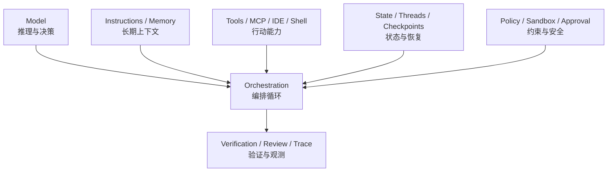
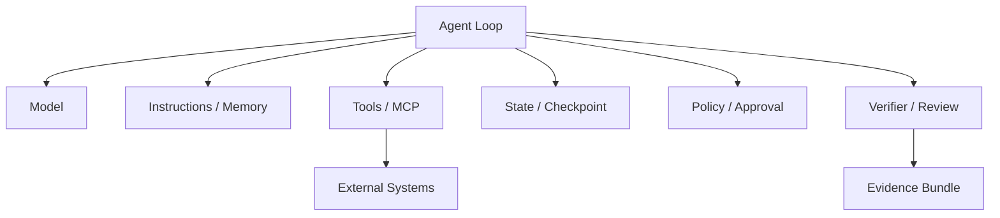
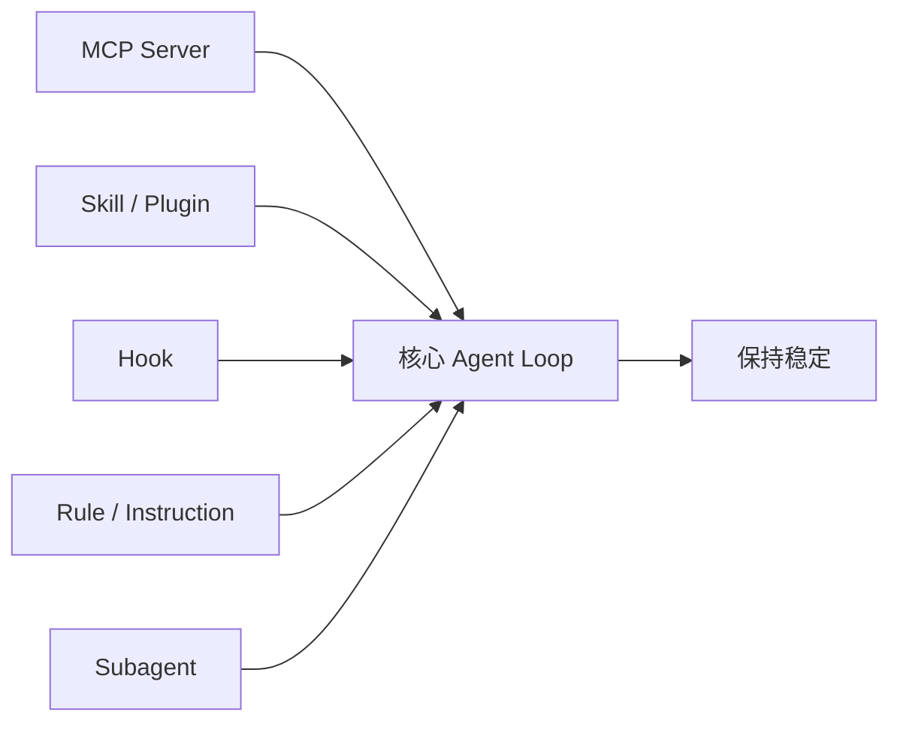
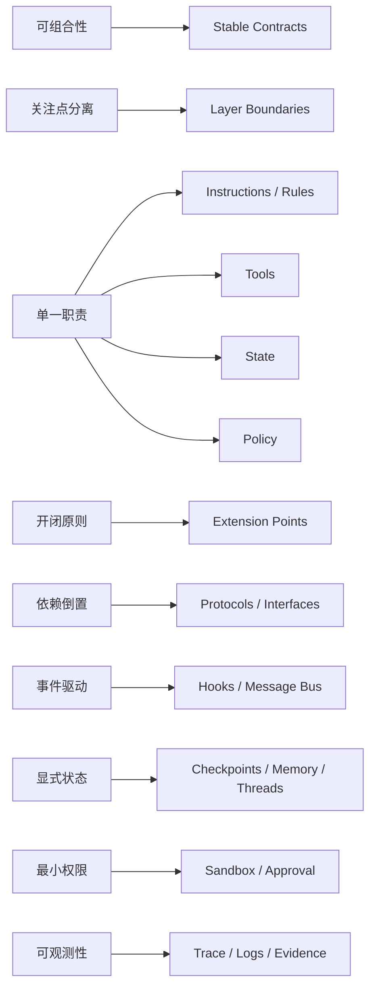
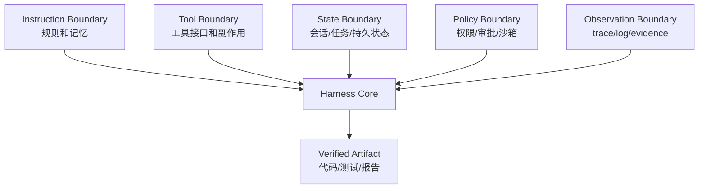

# Agent Harness 中的软件设计原则

检查日期：2026-07-05 Asia/Shanghai

本文比较 Claude Code、Codex、LangGraph、AutoGen、Cursor 的组件设计如何体现以下软件设计原则：

1. 可组合性
2. 关注点分离
3. 单一职责原则
4. 开闭原则
5. 依赖倒置
6. 观察者 / 事件驱动
7. 显式状态管理
8. 最小权限原则
9. 可观测性优先

这些原则不是各产品官方统一使用的术语，而是本 workspace 对 agent harness 进行工程分析的视角。

## 总览



可组合性来自这些组件之间边界清楚：模型、指令、工具、状态、策略、验证可以独立替换或扩展。关注点分离则体现在每个组件只承担一类变化原因。

## 一句话对比

| 系统 | 设计倾向 | 最明显的原则体现 |
| --- | --- | --- |
| Claude Code | 本地工程 agent runtime | Hooks、MCP、memory、permissions 各司其职，强调可脚本化和生命周期扩展。 |
| Codex | policy-aware coding harness | `AGENTS.md`、skills、plugins、hooks、MCP、sandbox、approval、threads 分层清晰。 |
| LangGraph | 低层有状态编排运行时 | graph/state/checkpoint/interrupt/store 分离，强调持久执行和可恢复状态。 |
| AutoGen | 多 agent 应用框架 | AgentChat/Core/Extensions/Studio 分层，Core 使用 actor model 和异步消息。 |
| Cursor | IDE-native coding agent | Agent = instructions + tools + model；Rules、Run Modes、MCP、checkpoints 与 IDE 上下文分离。 |

## 成熟度速览

这里的“强/中/依赖外部设计”不是产品优劣排名，而是指该原则是否被做成一等机制、是否有清楚接口、是否容易被用户或团队治理。

| 原则 | Claude Code | Codex | LangGraph | AutoGen | Cursor | 观察 |
| --- | --- | --- | --- | --- | --- | --- |
| 可组合性 | 强 | 强 | 强 | 强 | 中-强 | 五者都把 agent 拆成可组合部件；LangGraph/AutoGen 更像框架组合，Claude Code/Codex/Cursor 更像产品内扩展组合。 |
| 关注点分离 | 强 | 强 | 强 | 强 | 中-强 | 指令、工具、状态、权限、观测被拆到不同机制；Cursor 因 IDE 深度集成，边界更偏产品体验。 |
| 单一职责 | 强 | 强 | 强 | 强 | 中-强 | 五者都在拆分 model、tools、instructions、state、policy；Cursor 更深地嵌入 IDE 体验。 |
| 开闭原则 | 强 | 强 | 强 | 强 | 中-强 | MCP、hooks、skills/plugins、graph nodes、agents/tools 都是扩展点。 |
| 依赖倒置 | 中-强 | 强 | 强 | 强 | 中 | LangGraph/AutoGen 更框架化；Claude Code/Codex/Cursor 更产品化，但都通过工具协议和配置抽象低层实现。 |
| 事件驱动 | 强 | 中-强 | 强 | 强 | 中 | Claude Code hooks 和 AutoGen Core 最显式；LangGraph 通过状态转移、streaming、interrupt 体现。 |
| 显式状态管理 | 中-强 | 强 | 强 | 强 | 中 | LangGraph 最核心；Codex 和 Claude Code 通过 thread/session/memory/compaction 产品化。 |
| 最小权限 | 强 | 强 | 依赖外部设计 | 中 | 强 | Coding agent 产品通常内置权限和 sandbox；框架需要应用作者在工具和部署层落实。 |
| 可观测性优先 | 中-强 | 强 | 强 | 强 | 中-强 | LangSmith、OpenTelemetry、transcript、approval records、checkpoints 等形成不同粒度证据链。 |

## 1. 可组合性

可组合性要求 harness 的能力可以像软件组件一样被组合：模型、指令、工具、状态、策略、验证、记忆、子 agent、外部系统集成可以独立接入，并通过稳定契约协作。它回答的问题是：能不能在不重写系统的情况下，把新的能力拼进现有 agent loop。



| 系统 | 可组合性体现 | 组合边界 |
| --- | --- | --- |
| Claude Code | `CLAUDE.md`、skills、hooks、MCP、subagents、Agent SDK、CLI pipeline 可以组合成本地工程流。 | 以生命周期事件、外部工具协议和本地项目文件为主要边界。 |
| Codex | `AGENTS.md`、skills、plugins、MCP、hooks、custom agents、sandbox profiles、threads 可以组合为团队级 coding harness。 | 以任务线程、权限策略、工具协议和可安装扩展为边界。 |
| LangGraph | node、edge、state schema、checkpointer、store、interrupt、subgraph 可以组合成有状态 workflow。 | 以 graph runtime 和显式 state transition 为边界。 |
| AutoGen | agents、teams、tools、model clients、Core runtime、messages、extensions 可以组合为多 agent 系统。 | 以 agent/message/runtime 抽象为边界。 |
| Cursor | Rules、MCP、IDE tools、Run Modes、checkpoints、terminal/browser、AGENTS.md 可以组合为 IDE 内开发闭环。 | 以 IDE 上下文、工具调用和运行模式为边界。 |

可组合性的关键不是“功能多”，而是组合后仍有清楚契约：输入是什么、输出是什么、权限是什么、失败如何暴露、证据如何保留。

可测试信号：

- 新工具、新规则、新验证器或新子 agent 可以独立加入和移除。
- 不同组件通过 schema、protocol、event、state 或 file contract 协作。
- 组合顺序和作用域可解释，不依赖隐含 prompt 魔法。
- 组合失败时能定位到具体组件，而不是整个 agent 失控。

## 2. 关注点分离

关注点分离要求不同变化原因被放在不同位置。它比单一职责更偏架构层：上下文选择、工具执行、权限控制、状态持久化、验证、观测、人工干预不应混在同一个隐式流程里。

| 关注点 | 应有边界 | 常见错误 |
| --- | --- | --- |
| 指令和记忆 | `AGENTS.md`、`CLAUDE.md`、Rules、memory store。 | 把长期规则、临时任务和安全策略都塞进一个 prompt。 |
| 工具和副作用 | Tool registry、MCP、IDE/shell/browser adapters。 | 让模型直接描述副作用，缺少结构化工具边界。 |
| 状态和恢复 | Thread、session、checkpoint、state schema、store。 | 状态只存在于聊天上下文，无法恢复或回放。 |
| 策略和权限 | Sandbox、approval、allowlist、managed policy。 | 用“请不要做危险事”替代真正的权限控制。 |
| 验证和证据 | Tests、review、trace、logs、artifact bundle。 | 只保留最终回答，不保留验证过程。 |

| 系统 | 关注点分离体现 | 风险点 |
| --- | --- | --- |
| Claude Code | memory、hooks、MCP、settings、permissions、subagents 分别承担上下文、生命周期、集成、配置、约束和分工。 | memory 是上下文不是强制策略，不能替代权限边界。 |
| Codex | `AGENTS.md`、skills/plugins、MCP、sandbox/approval、threads、hooks、review evidence 分层明显。 | 扩展越多，越需要统一 managed policy 和证据标准。 |
| LangGraph | graph、state、node、edge、checkpointer、store、interrupt 分工清楚。 | OS sandbox、密钥、外部系统权限需要应用层补齐。 |
| AutoGen | AgentChat、Core、Extensions、Studio，以及 agent/tool/model client/runtime/message 分层。 | 多 agent 系统容易把职责拆得过细，需要消息协议和观测治理。 |
| Cursor | Rules、tools、model、Run Modes、checkpoints、IDE context 分开配置。 | IDE 上下文强，容易让用户误以为打开文件、规则和安全策略是同一层。 |

可测试信号：

- 修改一个关注点时，其它关注点不需要联动修改。
- 权限、验证、状态和观测不依赖模型“自觉遵守”。
- 文档能说明每个文件、配置、hook、tool、state store 各管什么。
- 评测能区分失败来自上下文选择、工具实现、权限策略、状态恢复还是验证设计。

## 3. 单一职责原则

单一职责原则要求一个组件只有一个主要变化原因。在 agent harness 中，它体现为：指令、工具、状态、权限、编排、观测不要混在一个大 prompt 或大 loop 中。

| 系统 | 体现方式 | 价值 |
| --- | --- | --- |
| Claude Code | `CLAUDE.md` 负责持久指令，auto memory 负责学习到的上下文，hooks 负责生命周期自动化，MCP 负责外部工具和数据，permissions/settings 负责约束。 | 记忆、扩展、集成、约束可以分别演进。 |
| Codex | `AGENTS.md` 负责 repo guidance，skills 负责可复用工作流，plugins 负责打包分发，MCP/app connectors 负责外部能力，sandbox/approval 负责安全边界，threads 负责会话状态。 | 工程治理面清楚，适合团队级默认行为。 |
| LangGraph | `StateGraph` 管状态转移，node 管一步计算，edge 管流程，checkpointer 管持久化，store 管长期记忆，interrupt 管人工介入。 | 适合复杂流程，每个节点可以独立测试和替换。 |
| AutoGen | AgentChat 负责快速多 agent 应用，Core 负责事件驱动 runtime，Extensions 负责模型和工具集成，Studio 负责可视化构建和调试。 | 高层易用性和低层 runtime 能力分离。 |
| Cursor | Instructions/Rules 管行为指导，Tools 管能力，Model 管推理，Run Modes 管执行策略，Checkpoints 管本地回滚，IDE 管上下文入口。 | IDE 体验强，但关键能力仍可被独立配置。 |

反例是把所有规则、工具说明、测试要求、权限策略都写进一个超长 prompt。这样短期能跑，长期不可维护。

可测试信号：

- 修改工具实现时，不需要改长期记忆或任务规则。
- 修改权限策略时，不需要重写 agent prompt。
- 新增验证步骤时，不需要侵入核心推理循环。
- 失败能归因到上下文、工具、状态、权限、验证中的某一层。

## 4. 开闭原则

开闭原则要求系统对扩展开放，对修改关闭。在 agent harness 中，理想形态是：不改核心 agent loop，也能增加工具、规则、流程、验证和集成。



| 系统 | 扩展点 | 对核心的影响 |
| --- | --- | --- |
| Claude Code | MCP、skills、hooks、subagents、Agent SDK、CLI pipe/script。 | 不需要改 Claude Code 主循环即可接入新工具、自动化或自定义 agent。 |
| Codex | MCP、skills、plugins、hooks、custom agents、config profiles。 | 能把团队流程打包为可安装、可配置、可审查的扩展。 |
| LangGraph | 新 node、新 edge、新 state schema、新 checkpointer、新 subgraph、新 store。 | 扩展是 graph 结构的一部分，核心 runtime 不需要改变。 |
| AutoGen | 新 agent、新 tool、新 model client、新 runtime、新 team pattern、新 extension。 | 多 agent 拓扑可以扩展，底层通信模型保持稳定。 |
| Cursor | Rules、MCP、Run Mode config、Browser/terminal tools、AGENTS.md、team rules。 | IDE agent 能通过配置和外部工具扩展，而不是修改产品核心。 |

关键判断：扩展点是否有明确接口。如果只是“把更多东西塞进 prompt”，不是良好的开闭原则。

可测试信号：

- 能用 MCP、plugin、skill、hook、node、agent 或 rule 增加能力。
- 扩展可以单独启用、禁用、版本化和审查。
- 核心 loop 对新增工具只关心 schema、权限和结果，不关心工具内部实现。
- 出问题时能停用扩展，而不是回滚整个 harness。

## 5. 依赖倒置

依赖倒置要求高层策略不直接依赖低层实现，而依赖抽象。在 agent harness 中，agent 不应直接绑定某个数据库、浏览器、模型厂商或命令执行方式，而应依赖 tool、model client、runtime、MCP、policy 等抽象。

| 系统 | 抽象层 | 设计含义 |
| --- | --- | --- |
| Claude Code | MCP 抽象外部系统；hooks 抽象生命周期事件；Agent SDK 抽象自定义 orchestration；settings 抽象权限和行为。 | Claude 不需要内置每个 SaaS 或企业系统，通过协议和 hook 接入。 |
| Codex | MCP/app connectors、model provider、skills/plugins、sandbox profiles、approval policy。 | 高层 coding loop 依赖工具和策略抽象，可以随 surface 或组织策略切换。 |
| LangGraph | graph runtime 不要求具体模型或工具；可与 LangChain 组件结合，但不依赖 LangChain。 | 编排层依赖 callable node/state 接口，而不是某个 LLM 或工具实现。 |
| AutoGen | `model_client`、tools、agents、runtime、messages。 | Agent 依赖 model client 和 tool registry，具体模型和工具可替换。 |
| Cursor | Agent 由 instructions、tools、model 构成；MCP 作为外部工具协议；terminal/browser 作为工具能力。 | IDE agent 不应直接把某个外部系统写死进核心体验。 |

依赖倒置带来的工程收益是可迁移性：换模型、换工具、换权限策略、换部署形态，不必重写整个 agent。

可测试信号：

- 同一任务可在不同模型、不同 shell 或不同外部 API 后端间切换。
- 高层 workflow 面向 `Tool`、`ModelClient`、`Runtime`、`Policy` 等抽象编程。
- 低层工具失败时，agent loop 能看到结构化错误，而不是只能解析自由文本。
- 安全策略能独立于工具实现配置。

## 6. 观察者 / 事件驱动

观察者和事件驱动原则要求系统对事件作出反应，而不是把所有逻辑塞进同步主流程。在 agent harness 中，典型事件包括：用户提交 prompt、工具调用前后、权限请求、状态变更、文件变更、任务完成、会话结束。

```mermaid
sequenceDiagram
    participant Loop as Agent Loop
    participant Bus as Event / Hook Layer
    participant Policy as Policy Handler
    participant Verifier as Verifier
    participant Logger as Logger

    Loop->>Bus: PreToolUse
    Bus->>Policy: 检查是否允许
    Policy-->>Bus: allow / deny
    Bus-->>Loop: 决策
    Loop->>Bus: PostToolUse
    Bus->>Verifier: 运行验证
    Bus->>Logger: 记录证据
```

| 系统 | 事件驱动体现 | 适合场景 |
| --- | --- | --- |
| Claude Code | Hooks 生命周期覆盖 session、prompt、tool、permission、subagent、compaction、file change 等事件。 | 自动格式化、阻断危险命令、Stop 前验证、记录审计日志。 |
| Codex | Hooks、approval requests、thread events、subagent activity、automations。 | 生命周期策略、权限审批、自动检查、团队默认流程。 |
| LangGraph | Streaming、interrupts、human-in-the-loop、state transition、checkpoint 恢复。 | 长任务、人工介入、可恢复 workflow。 |
| AutoGen | Core 使用 actor model 和异步消息；agents 通过 message/event 交互。 | 多 agent 协作、分布式 agent、异步 request/response。 |
| Cursor | Run Modes 对 tool calls 做审批/分类；MCP tool approval；queued messages；checkpoints。 | IDE 内持续交互、工具调用审批、用户中途插队指令。 |

事件驱动的好处是扩展不污染主逻辑；风险是隐藏副作用变多，所以必须配套日志、调试和超时策略。

可测试信号：

- 工具调用前后、权限请求、任务停止、状态压缩、文件变更等事件都有可订阅位置。
- 事件处理器可以拒绝、修改、补充或记录动作。
- Hook/handler 失败有明确策略：阻断、降级、重试或只记录。
- 同一个事件可以同时触发 policy、verification 和 telemetry，而不耦合三者。

## 7. 显式状态管理

Agent 的状态不能只藏在聊天上下文里。显式状态管理要求把任务状态、会话状态、工作区状态、检查点、长期记忆、工具结果分开管理。

| 系统 | 状态机制 | 设计价值 |
| --- | --- | --- |
| Claude Code | session、resume、context window、compaction、CLAUDE.md load order、auto memory、subagent state。 | 让本地长期工作和跨 surface 使用更可控。 |
| Codex | threads、resume、compaction、memories、Chronicle、sandbox/workspace state、subagent threads。 | 适合长任务、远程/本地切换和审计。 |
| LangGraph | State schema、checkpointers、stores、time travel、interrupts、persistence。 | 状态是 graph 的核心输入输出，可恢复、可测试、可回放。 |
| AutoGen | Agent state、team state、message history、Core runtime identity/lifecycle、serializable components。 | 多 agent 系统能保存、恢复、迁移和调试。 |
| Cursor | Chat context、Rules、codebase index、checkpoints、queued messages、workspace files。 | IDE 内迭代开发可回滚、可继续、可定位上下文。 |

最成熟的是 LangGraph：它从设计目标上就是有状态编排 runtime。Claude Code、Codex、Cursor 更偏产品化 coding agent，把状态拆在 session、memory、checkpoint 和配置中。

可测试信号：

- 状态 schema 或状态类别能被写下来，而不是只存在于聊天历史。
- 可以恢复、回放或解释一次长任务在关键步骤上的状态变化。
- 短期上下文、长期记忆、工作区文件、工具结果和验证证据不会混为一谈。
- compaction 或 checkpoint 后，任务仍保留完成所需的不变量和决策记录。

## 8. 最小权限原则

最小权限原则要求 agent 只获得完成当前任务所需的能力。对 coding agent 来说，危险不在“回答错”，而在“错误地执行真实副作用”：删文件、泄密、改生产配置、访问外部系统、运行破坏性命令。

| 系统 | 最小权限机制 | 关键判断 |
| --- | --- | --- |
| Claude Code | Permission modes、settings、managed policy、sandbox、PreToolUse hooks、MCP/server 控制。 | 记忆不是强制规则；真正阻断要靠 permission/hook/sandbox。 |
| Codex | Sandbox modes、approval policy、permission profiles、network/file rules、managed requirements、subagent policy inheritance。 | 权限模型最显式，适合把组织策略写成默认运行边界。 |
| LangGraph | 自身不主要提供 OS sandbox；通过 graph 节点、工具封装、human interrupt、deployment policy 控制能力。 | 编排层强，但具体权限要在工具和部署环境设计。 |
| AutoGen | Tool registry、intervention handler、human-in-the-loop、runtime/environment controls。 | 多 agent 系统必须限制每个 agent 的工具和消息范围。 |
| Cursor | Run Modes、Auto-review、Allowlist、sandbox.json、permissions.json、team controls、MCP allowlist。 | Auto-review 不是安全边界；sandbox 和显式 allowlist 更可靠。 |

最小权限在实践上应落到三件事：

1. 默认只读，明确需要时再写。
2. 默认无网络，明确域名和工具后再放开。
3. 高风险命令和外部写操作必须审批。

可测试信号：

- 新工具默认不可用，必须显式注册和授权。
- 写文件、运行命令、访问网络、读取密钥、调用生产系统是不同权限。
- 子 agent、MCP server、hook 不会自动获得超出任务需要的能力。
- 审批记录能说明谁批准了什么、在什么上下文下批准、结果是什么。

## 9. 可观测性优先

Agent 系统不可观测，就不可调试、不可评估、不可治理。可观测性优先要求保留工具调用、输入输出、状态变化、成本、延迟、验证证据和失败归因。

| 系统 | 可观测性机制 | 主要价值 |
| --- | --- | --- |
| Claude Code | Debug logs、hook execution details、session transcript、tool results、diff review。 | 便于解释某个工具调用为何执行、为何被阻断或为何验证失败。 |
| Codex | Threads、tool transcript、approval records、sandbox output、review UI、Codex Security evidence。 | 能把变更、命令、测试、stdout/stderr、artifact 作为审计证据。 |
| LangGraph | LangSmith tracing、state transition visualization、runtime metrics、evaluation。 | 对复杂 graph 和长任务尤其重要，能看到路径和状态变化。 |
| AutoGen | Logging、OpenTelemetry、tracing、Studio debug/evaluation。 | 多 agent 通信复杂，必须能追踪消息、agent 行为和工具结果。 |
| Cursor | Chat/tool output、MCP logs、checkpoints、Agent Review、terminal/browser output。 | IDE 内能把执行过程、回滚点和验证结果贴近开发流程。 |

可观测性不是最后加的日志，而是 harness 的设计前提。没有 trace，就无法回答：

- Agent 为什么读了这些文件？
- 为什么选择这个工具？
- 哪个权限策略阻断了动作？
- 哪个测试证明结果正确？
- 失败来自模型判断、上下文缺失、工具错误、权限不足，还是环境问题？

可测试信号：

- 每次运行都有 transcript、tool call、exit code、diff、测试输出和最终 artifact。
- Trace 能把一次失败定位到具体节点、agent、hook、tool 或 permission decision。
- 成本、延迟、重试、上下文大小、token 使用量至少能被采集。
- 评测结论能追溯到原始日志，而不是只保留人工总结。

## 原则到组件的映射



| 原则 | 最应落到的组件 | 不应落到的地方 |
| --- | --- | --- |
| 可组合性 | stable contracts、extension points、tool schemas、subgraphs、subagents、artifact bundle。 | 只能靠复制 prompt 或改核心 loop 复用能力。 |
| 关注点分离 | instruction boundary、tool boundary、state boundary、policy boundary、observation boundary。 | 把上下文、工具、副作用、权限和验证混在一个隐式流程。 |
| 单一职责 | instruction files、tool registry、state store、policy engine、verifier。 | 一个万能 prompt 或一个巨大 `run()` 函数。 |
| 开闭原则 | MCP、plugin、skill、hook、node、subagent、rule。 | 修改核心 loop 才能加能力。 |
| 依赖倒置 | model client、tool schema、runtime interface、policy interface。 | 高层 workflow 直接绑定某个供应商 API 或本地命令细节。 |
| 事件驱动 | lifecycle hooks、message bus、stream events、interrupts。 | 同步主流程里散落的副作用。 |
| 显式状态管理 | thread、checkpoint、state schema、memory、artifact bundle。 | 未结构化聊天上下文。 |
| 最小权限 | sandbox、approval、allowlist、managed policy。 | prompt 里的“请不要做危险事”。 |
| 可观测性优先 | trace、logs、diff、test result、cost metrics、evidence。 | 最终一句“已完成”。 |

## 原则之间的张力

这些原则并不总是同向：

| 张力 | 说明 | 应对 |
| --- | --- | --- |
| 可组合性 vs 简单性 | 扩展点越多，理解成本越高。 | 先用最小可用 harness，再按重复痛点加入扩展。 |
| 开闭原则 vs 安全 | 插件、MCP、hooks 增加能力，也增加供应链和权限风险。 | 扩展必须经过 allowlist、trust review 或 managed policy。 |
| 显式状态 vs 隐私 | 记录更多状态有利于恢复和调试，也可能保留敏感信息。 | 状态分级、脱敏、可删除、限制记忆生成。 |
| 事件驱动 vs 可调试性 | Hook 和异步事件隐藏控制流。 | 所有事件处理都要有日志、超时和失败策略。 |
| 最小权限 vs 体验 | 严格审批会打断流畅性。 | 对低风险重复操作 allowlist，对高风险操作强审批。 |

## 对 Harness 设计的启发

一个可持续演进的 agent harness 应该具备这些边界：



设计时优先问：

1. 这个能力属于指令、工具、状态、策略、编排，还是观测？
2. 它能否独立测试？
3. 它是否有清楚的输入输出契约？
4. 它是否扩大了副作用半径？
5. 它失败时能否被定位和恢复？
6. 它是否需要进入团队级 managed policy？

## 结论

Claude Code、Codex、LangGraph、AutoGen、Cursor 的共同方向是：把 agent 从“一个大 prompt”拆成可组合的软件系统。它们的差别不只是功能多少，而是谁把哪类关注点做成了一等组件。

- Claude Code 强在生命周期扩展和本地工程自动化。
- Codex 强在策略、权限、线程和可审计工程流。
- LangGraph 强在显式状态和有状态编排。
- AutoGen 强在多 agent 事件驱动架构。
- Cursor 强在 IDE 上下文、规则和交互式开发闭环。

对我们研究 harness 的价值在于：评估一个 agent 系统时，不只看模型能力，而要看它是否把职责拆清楚、是否允许安全扩展、是否可观察、是否能恢复、是否能被团队治理。

## 来源

- Claude Code overview: https://code.claude.com/docs/en/overview
- Claude Code memory: https://code.claude.com/docs/en/memory
- Claude Code hooks: https://code.claude.com/docs/en/hooks
- Claude Code settings: https://code.claude.com/docs/en/settings
- Claude Code MCP: https://code.claude.com/docs/en/mcp
- Codex manual: https://developers.openai.com/codex/codex-manual.md
- LangGraph overview: https://docs.langchain.com/oss/python/langgraph/overview
- AutoGen AgentChat quickstart: https://microsoft.github.io/autogen/stable/user-guide/agentchat-user-guide/quickstart.html
- AutoGen Core: https://microsoft.github.io/autogen/stable/user-guide/core-user-guide/index.html
- Cursor Agent overview: https://cursor.com/docs/agent/overview.md
- Cursor Rules: https://cursor.com/docs/rules.md
- Cursor Run Modes: https://cursor.com/docs/agent/security/run-modes.md
- Cursor MCP: https://cursor.com/docs/mcp.md
