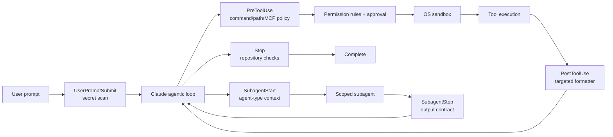

# Claude Code Hooks 工程实战

检查与实验日期：2026-07-12 Asia/Shanghai

## 问题

如何用一套小而可运行的 Claude Code hooks，同时处理：

1. 安全防护体系。
2. 代码质量自动化。
3. 子智能体精确上下文管理。

## 实验对象与边界

- Harness：Claude Code lifecycle hooks。
- Claude Code contract：2026-07-12 官方 hooks、permissions 和 subagents 文档。
- 本机 Claude Code：未安装，未执行端到端 lifecycle trigger。
- Probe runtime：Python 3.14.5，只有标准库；`jq 1.8.1` 仅用于手动检查 JSON。
- Model：不适用。Fixture probes 不调用模型。
- Budget：0 model tokens；13 个本地 hook fixture cases。

本实验测试的是 hook handler 的确定性输入输出，不声称已经验证 Claude Code 某个具体客户端版本的 event delivery。

## 架构



设计原则是让不同 hook 只承担一个时间点最适合的责任：

| 阶段 | Hook | 责任 | 不承担的责任 |
| --- | --- | --- | --- |
| Prompt 前 | `UserPromptSubmit` | 防止明显 secret 进入模型 context | DLP 全量替代、语义安全判断 |
| Tool 前 | `PreToolUse` | deny/ask 高风险 command、path、MCP tool | OS 隔离、完整 shell parsing |
| Tool 后 | `PostToolUse` | 对刚编辑的文件做快速 formatter | 回滚已发生副作用、运行全量测试 |
| 完成前 | `Stop` | 执行 repo-level checks，失败时要求继续 | 每次编辑都执行昂贵 suite |
| Subagent 启动 | `SubagentStart` | 按 `agent_type` 注入最小动态契约 | 复制整个 parent transcript |
| Subagent 停止 | `SubagentStop` | 校验结果结构，缺项时要求补全 | 把 subagent 原始日志塞回主 context |

## 1. 安全防护体系

### 分层模型

安全控制不应只依赖 hook：

```text
Managed policy
  -> permission deny/ask/allow
  -> PreToolUse hook
  -> approval UI
  -> sandbox/filesystem/network boundary
  -> tool process
```

本实验的 [security_guard.py](./hooks/security_guard.py) 只承担快速、确定性的 defense in depth：

- `UserPromptSubmit`：扫描 private key header、GitHub token、AWS access key 和常见 credential assignment 形状。
- `PreToolUse` file tools：拒绝 workspace 外写入，以及 `.env`、`.git/**`、credentials 和 secrets paths。
- `PreToolUse` shell tools：拒绝明确 destructive command，对 force push 和 infrastructure mutation 返回 `ask`。
- `PreToolUse` MCP tools：对名称表现为 create/delete/publish/send/update/write 的 MCP tool 返回 `ask`。

Policy 位于 [security-policy.json](./policies/security-policy.json)，代码和规则分离，便于 review 和单测。

### 决策规则

| 风险 | 行为 | 原因 |
| --- | --- | --- |
| 已知 destructive 或 protected path | `deny` | 不应依赖用户临场判断 |
| 可能合法但影响外部状态 | `ask` | 保留 human-in-the-loop |
| 无匹配 | 无输出、exit `0` | 继续正常 permission flow，不自动批准 |
| Policy 无法加载或 handler 异常 | `continue: false` | 示例选择 fail closed；生产中需同时设计 availability |

### 工程限制

观察结果：

- Regex command matcher 不能完整解析 shell AST，也可能存在 false positive/negative。
- `PreToolUse` 只治理该事件实际覆盖的工具路径。
- Prompt secret scan 只能发现已知形状，不能替代组织级 DLP。
- Hook process 本身是受信代码；输入必须按 attacker-controlled data 处理。

建议：

- 绝对禁止项放 permission deny 和 sandbox；hook 用于上下文相关判断。
- 初次上线将中风险规则设为 `ask`，采集命中率后再决定是否 allow/deny。
- 日志只记录 rule id、event、tool 和 decision，不记录 prompt、secret 或完整 command payload。
- Enterprise 场景由 managed settings 分发 hook 与 policy，并对变更做 code review 和 hash/version tracking。

## 2. 代码质量自动化

### 两级质量门

[quality_automation.py](./hooks/quality_automation.py) 使用两个 cadence：

1. `PostToolUse`：仅对本次 Edit/Write 的 file suffix 选择 formatter。
2. `Stop`：执行 [quality-policy.example.json](./policies/quality-policy.example.json) 中的 repository checks。

默认示例支持：

- Python：`ruff format`。
- JavaScript/TypeScript/JSON/CSS：repository-local Prettier。
- Go：`gofmt`。
- Stop gate：`git diff --check`。

Formatter 通过 argv array 和 `subprocess.run(..., shell=False)` 执行，不拼接 shell command。`{file}` 和 `{cwd}` 只作为完整 argv element 替换。

### 为什么分成 `PostToolUse` 与 `Stop`

| 方案 | 延迟 | 反馈范围 | 适用任务 |
| --- | --- | --- | --- |
| 每次编辑后 formatter | 低 | 单文件 | 确定性格式修复 |
| 每次编辑后全量 test | 高 | 全仓库 | 不建议，拖慢 agent loop |
| Stop 时 lint/test/typecheck | 一次性 | 任务级 | 完成门禁 |

`PostToolUse` formatter 失败时返回 feedback，但文件写入已经发生，hook 不能回滚。`Stop` check 失败时返回：

```json
{
  "decision": "block",
  "reason": "Quality gate failed: ..."
}
```

这会阻止 Claude 结束并要求修复。若 `stop_hook_active` 已为 `true` 且检查仍失败，示例返回 `continue: false` 和 `stopReason`，显式终止本次 run：既避免无限 loop，也不把未通过门禁的状态当成成功。

生产 policy 应按项目替换 `checks`，例如：

- Java：focused Maven/Gradle test、Checkstyle、SpotBugs。
- TypeScript：typecheck、lint、focused test。
- Python：Ruff、mypy/pyright、focused pytest。
- Go：gofmt check、go vet、focused go test。

不要把所有检查无条件塞进一个 Stop hook。按任务类别、changed paths 和风险画像选择命令，并为每条命令设置 timeout。

## 3. 子智能体精确上下文管理

### 上下文分层

Claude Code 官方文档在检查日说明：subagent 有独立 context window；Explore 和 Plan 为保持轻量会跳过 `CLAUDE.md` 与 parent git status，其他 built-in/custom subagents 会加载它们。这意味着上下文应分层：

| 内容 | 最合适的载体 |
| --- | --- |
| 所有 agent 都必须遵守的稳定仓库规则 | `CLAUDE.md`、permissions、managed policy |
| 某类 agent 的稳定职责、tools、model、turn limit | `.claude/agents/<name>.md` frontmatter/body |
| 当前启动时才知道的任务边界、evidence 格式 | `SubagentStart.additionalContext` |
| 本次具体委派目标 | Agent invocation prompt |
| 返回前完整性检查 | `SubagentStop` |

[subagent_context.py](./hooks/subagent_context.py) 按 `agent_type` 从 [subagent-context.json](./policies/subagent-context.json) 选取最小契约：

- `Explore`：read-only discovery、路径与行号 evidence、禁止返回 raw search logs。
- `Plan`：不编辑，输出 dependency、verification、rollback risk。
- `security-reviewer`：只关注 changed trust boundaries，finding 必须含 severity/evidence/impact/remediation。
- `default`：限制 scope、区分 observation/recommendation、压缩返回内容。

项目 custom agent 示例见 [security-reviewer.md](./agents/security-reviewer.md)。其 tool allowlist 只有 `Read`、`Grep`、`Glob`；capability restriction 放在 agent definition，而不是依赖 prompt 自律。

### 输出契约

`SubagentStart` 注入：

```json
{
  "hookSpecificOutput": {
    "hookEventName": "SubagentStart",
    "additionalContext": "Scoped contract for subagent type Explore: ..."
  }
}
```

`SubagentStop` 检查 required Markdown sections。缺少 Evidence/Unknowns 时返回顶层 `decision: "block"`，reason 作为 subagent 下一条指令。若一次 continuation 后仍不完整，`stop_hook_active` 分支使用 `continue: false` hard stop，防止无限 loop。

这是一种 output-shape completeness check，不是结果正确性证明。更高风险的任务仍需 parent agent 或独立 reviewer 验证 evidence。

### 精确上下文的判断标准

建议让每条注入内容通过四个问题：

1. 是否只与当前 `agent_type` 有关？
2. Subagent 不知道它会导致错误，而不仅是稍有帮助吗？
3. 能否通过 tool allowlist、permission 或 agent body 更机械地表达？
4. 返回结果能否压缩为 evidence，而不是复制探索过程？

不能通过这些问题的内容不应进入 `SubagentStart.additionalContext`。

## 文件布局

```text
.
├── README.md
├── setup.md
├── run.md
├── results.md
├── agents/
│   └── security-reviewer.md
├── artifacts/
│   └── test-output.txt
├── config/
│   └── settings.example.json
├── hooks/
│   ├── hooklib.py
│   ├── quality_automation.py
│   ├── security_guard.py
│   └── subagent_context.py
├── policies/
│   ├── quality-policy.example.json
│   ├── security-policy.json
│   └── subagent-context.json
└── tests/
    ├── fixtures/
    └── run_tests.py
```

## 采用建议

1. 先运行 fixture tests，确认 policy output。
2. 用临时 `--settings` 启动 Claude Code，只启用一个事件族并打开 debug log。
3. 观察一周的误报、延迟、timeout 和 hook failure，再逐步启用 Stop/SubagentStop blocking。
4. 把 sandbox、permission rules 和 agent tool allowlist 先配置好，再叠加 hooks。
5. 将 project-specific check commands、protected paths 和 agent contracts 作为 code-reviewed policy 管理。

## 已知限制

- 本机没有 Claude CLI，尚未验证真实 event delivery、UI message 和 continuation 行为。
- 测试只验证脚本输出契约，没有模型参与，也不能测量 context 是否改善任务成功率。
- Security regex 是示例 policy，不构成通用 WAF/DLP/shell parser。
- Quality policy 需要按实际 repository toolchain 定制。
- Markdown section check 只验证输出形状，不验证 evidence 的真实性。

## 官方来源

- Claude Code hooks：https://code.claude.com/docs/en/hooks
- Claude Code permissions：https://code.claude.com/docs/en/permissions
- Claude Code subagents：https://code.claude.com/docs/en/sub-agents
